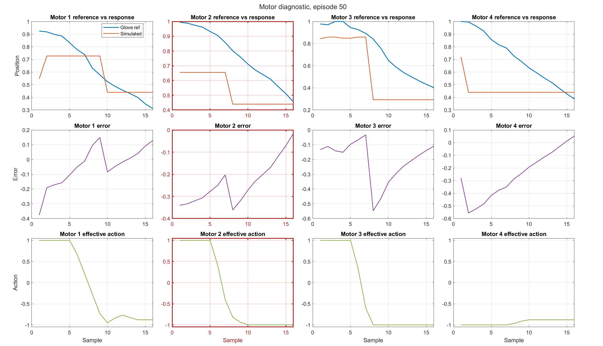
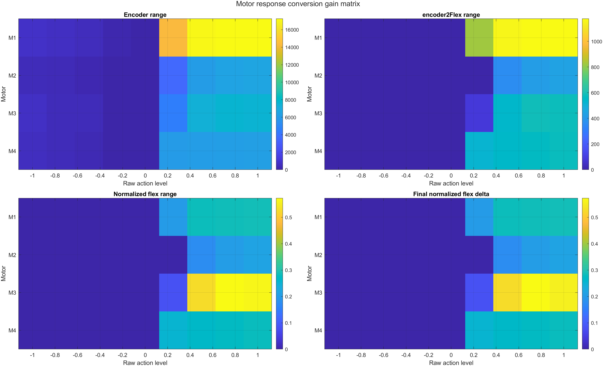

# 1. Resumen ejecutivo

Se entrenó un benchmark base con el algoritmo *Twin Delayed Deep
Deterministic Policy Gradient* (TD3) para controlar cuatro motores simulados
de una prótesis mioeléctrica. El propósito fue obtener una línea base
reproducible antes de continuar con variantes residuales, stop-band o
validaciones físicas. La campaña utilizó el estado `markov52`, la función de
recompensa `trackingMseActionRateReward`, cinco semillas y 12000 episodios
por semilla. Todo el trabajo se ejecutó con dataset pregrabado y motores
simulados; no se activó hardware ni se modificaron puertos COM.

El resultado agregado de la campaña fue **Rejected**: ninguna de las cinco
semillas alcanzó `ConditionA` o `ConditionB`. La media de seguimiento fue
`trackingMSE = 0.053591`, con `saturationFraction = 0.573518`. Aunque la
semilla 22 produjo el mejor checkpoint global en el episodio 6900, la
campaña no superó de forma robusta al benchmark histórico `Agent7250`.
El diagnóstico por motor identificó un comportamiento recurrente en el
motor 2: podía existir acción y movimiento de encoder sin un rango útil
proporcional en la salida flex normalizada. Este hallazgo motivó revisar la
conversión encoder-flex y ampliar posteriormente la validación a M1-M4.

# 2. Objetivo del benchmark base

El benchmark base se planteó con cinco objetivos técnicos:

1. Disponer de una línea TD3 reproducible, entrenada desde cero y separada
   de los experimentos residuales.
2. Determinar si la respuesta deficiente del motor 2 era exclusiva de
   Residual Lift o si también aparecía en una política TD3 base.
3. Obtener métricas comparables por semilla, checkpoint y motor.
4. Conservar evidencia de entrenamiento, auditoría y test visual del
   checkpoint seleccionado.
5. Evitar el paso a hardware mientras la simulación mantuviera respuestas
   planas, acciones sin movimiento o regresiones en motores no objetivo.

La campaña no pretendía reemplazar automáticamente a `Agent7250`. Su
propósito era comprobar si una repetición ordenada del entrenamiento base
podía alcanzar o superar esa referencia bajo la configuración actual.

# 3. Configuración de entrenamiento

La campaña revisada se encuentra documentada bajo
`Agentes/benchmark_td3_seeded_retrain_motor2_diagnostic/26-05-27_23-44-39/`.
Los valores se confirmaron en su summary y en el launcher de entrenamiento,
actualmente preservado como experimento pausado.

| Parámetro | Valor utilizado |
| --- | --- |
| Algoritmo | TD3 base |
| Agente inicial | Nuevo agente, entrenamiento desde cero |
| Variante de observación | `markov52` |
| Función de recompensa | `trackingMseActionRateReward` |
| Semillas | `[11 22 33 44 55]` |
| Episodios por semilla | `12000` |
| Guardado de checkpoint | Cada `100` episodios |
| Guardado periódico de episodio | Cada `100` episodios |
| Auditoría rápida | `20` simulaciones |
| Auditoría completa | `50` simulaciones |
| Candidatos completos | `topK = 5` |
| Test final | `50` episodios por checkpoint seleccionado |
| GPU | NVIDIA GeForce RTX 5070 Laptop GPU |
| Compatibilidad CUDA | Forward Compatibility habilitada |
| Dataset | Pregrabado |
| Hardware | No utilizado |
| `usePrerecorded` | `true` |
| `simMotors` | `true` |
| `connect_glove` | `false` |
| `unifyActions` | `false` |
| `actionInterfaceVariant` | `baselineQuantized` |
| `quantizeCommandsForSimulation` | `true` |

La GPU fue detectada y habilitada. El summary registra capacidad de cómputo
`12.0`, `gpuEnabled = true` y CUDA Forward Compatibility activa. Este dato
describe el recurso de entrenamiento; no altera la política de aceptación.


*Figura 1. Progreso de entrenamiento generado por MATLAB. La variabilidad
entre episodios y semillas justifica seleccionar checkpoints mediante una
auditoría posterior y no únicamente por el último episodio.*

# 4. Estado y observaciones usadas por el agente

La variante `markov52` tiene 52 componentes. Su composición se obtiene de
`calculateState.m` y de la configuración:

| Componente | Dimensión | Descripción |
| --- | ---: | --- |
| Características EMG | 40 | Salida normalizada de `getWmoosFeatures` para la ventana EMG actual |
| Posición de encoders | 4 | Último estado normalizado de los cuatro motores |
| Cambio de encoder | 4 | Diferencia entre encoder actual y anterior, limitada a `[-1, 1]` |
| Acción efectiva previa | 4 | Acción aplicada en el paso anterior, limitada a `[-1, 1]` |
| **Total** | **52** | Estado entregado al actor y críticos |

Por tanto:

```text
markov52 = 40 características EMG
         + 4 posiciones normalizadas
         + 4 cambios de posición
         + 4 acciones efectivas previas
```

Esta composición añade memoria de primer orden mediante el cambio de
encoder y la acción anterior. No apila tres ventanas EMG: el parámetro
`emgHistoryLength = 3` se utiliza en la variante separada
`stackedEmg132`, no en `markov52`.

La normalización de encoders usa divisores
`[26500 11500 8500 9000]`. La referencia de flex reducida y la salida
convertida desde encoder se normalizan con
`[4092 2046 1023 2046]`. La relación de motores utilizada en configuración
es `[little, idx, thumb, mid]`, correspondiente a M1-M4.

# 5. Función de recompensa

La reward oficial de esta campaña fue `trackingMseActionRateReward`. Para
cada motor `i`, el código calcula:

```text
error_i       = respuesta_i - referencia_i
deltaAccion_i = accion_i - accionPrevia_i

reward_i = -(error_i^2
             + 0.01 * accion_i^2
             + 0.05 * deltaAccion_i^2)

reward = promedio(reward_i para i = 1..4)
```

Los tres términos tienen funciones distintas:

- `error_i^2` penaliza el error cuadrático de seguimiento.
- `0.01 * accion_i^2` penaliza el esfuerzo de acción.
- `0.05 * deltaAccion_i^2` penaliza cambios rápidos entre acciones
  consecutivas.

La función también registra `trackingMSE`, `trackingMAE`, `actionL2`,
`deltaActionL2` y una fracción de saturación definida por
`abs(action) >= 0.95`. En esta reward concreta, la saturación se registra
pero no añade una penalización adicional: `saturationPenalty = 0`.

`configurables.m` contiene `rewardMotorWeights = [1 2 1 1]` y parámetros
de saturación para experimentos posteriores. Sin embargo,
`trackingMseActionRateReward` no utiliza pesos por motor ni
`rewardSaturationWeight`; esos campos pertenecen a variantes experimentales
y no deben atribuirse al benchmark oficial.

Una reward basada principalmente en MSE puede reducir error promedio sin
garantizar movimiento funcional. Si una referencia permanece cerca de una
zona limitada o si la conversión comprime la respuesta, una salida
conservadora puede obtener MSE moderado y seguir siendo visualmente plana.
Por eso la aceptación se complementó con rangos, saturación, acciones y
flags por motor.

# 6. Parámetros principales del experimento

| Grupo | Parámetro | Valor o criterio |
| --- | --- | --- |
| Acción | `actionInterfaceVariant` | `baselineQuantized` |
| Acción | `actionCommandLevels` | `[0 64 96 128 160 192 224 255]` |
| Acción | Umbral de activación | `0.05` |
| Acción | Velocidad/PWM máximo | `[255 255 255 255]` |
| Acción | Acciones unificadas | `false` |
| Conversión | `encoder2FlexVariant` oficial | `baseline` |
| Estado | `encoder2state_scale` | División por `[26500 11500 8500 9000]` |
| Flex | `flexJoined_scale` | División por `[4092 2046 1023 2046]` |
| Reward | Peso de acción | `0.01` |
| Reward | Peso de cambio de acción | `0.05` |
| Diagnóstico | Saturación registrada | `abs(action) >= 0.95` |
| Selección | Fase A / fase B | 20 simulaciones / 50 simulaciones |
| Selección | Candidatos completos | `topK = 5` |
| Selección | Criterio base | Estado de aceptación, tracking, esfuerzo y saturación |

Los criterios diagnósticos implementados posteriormente fueron:

- **`flat_response`**: la referencia tiene rango suficiente y la respuesta
  es menor o igual a `max(0.03, 0.35 * targetRange)`.
- **`action_no_motion`**: `actionL2` es relevante frente a los otros
  motores, pero la respuesta permanece bajo el mismo umbral de rango.
- **`high_action_flat_response`**: `actionL2 >= 0.70` o
  `saturationFraction >= 0.25`, con `targetRange >= 0.10` y respuesta baja.

Estos thresholds son criterios de diagnóstico, no términos de la reward.

# 7. Qué se añadió al flujo inicial

El flujo inicial permitía entrenar y probar un agente. Sobre esa base se
incorporaron capacidades de reproducibilidad y diagnóstico:

- semillas explícitas y campañas multiseed;
- creación de una carpeta independiente por corrida y por semilla;
- checkpoints periódicos y conservación de `training_info`;
- auditoría rápida y completa de checkpoints;
- selección y test final del checkpoint elegido;
- figuras de entrenamiento por seed y resumen agregado;
- métricas globales y métricas M1-M4;
- test visual con referencia, respuesta simulada, acción y error;
- sanity check de actuación y conversión para motor 2;
- validación posterior all-motor para evitar mejorar M2 dañando M1, M3 o M4;
- logging del estado de GPU y de la fuente del agente;
- summaries CSV, TXT y MAT;
- distinción explícita entre entrenamiento desde cero y evaluación de
  `Agent7250` congelado.

Estas adiciones no cambiaron los defaults oficiales. El flujo base conserva
`baselineQuantized`, `encoder2FlexVariant = "baseline"` y
`trackingMseActionRateReward`. Las variantes `motorCalibratedQuantized`,
`motor2Calibrated` y las rewards ponderadas permanecen experimentales.
Residual Lift y stop-band se conservaron como experimentos futuros, pero no
forman parte de la línea benchmark descrita aquí.

# 8. Resultados de la campaña benchmark base

La campaña produjo cinco checkpoints seleccionados, uno por semilla. Todos
quedaron clasificados como `Rejected`.

| Resultado agregado | Valor |
| --- | ---: |
| `ConditionA` | 0 |
| `ConditionB` | 0 |
| `Rejected` | 5 |
| Estado agregado | **Rejected** |
| Mejor seed global | Seed 22 |
| Episodio del mejor checkpoint | 6900 |

| Métrica de campaña | Media | Desviación estándar |
| --- | ---: | ---: |
| `trackingMSE` | 0.053591 | 0.012110 |
| `trackingMAE` | 0.181093 | 0.022777 |
| `actionL2` | 0.737733 | 0.092318 |
| `saturationFraction` | 0.573518 | 0.117074 |
| `deltaActionL2` | 0.349939 | 0.224863 |

| Diagnóstico M2 | Resultado |
| --- | ---: |
| `trackingMSE_motor2` medio | 0.045047 |
| `responseRange_motor2` medio | 0.140268 |
| Seeds con `motor2_flat_response` | 3 |
| Seeds con `motor2_action_no_motion` | 3 |
| Seeds con `motor2_tracking_outlier` | 0 |

El mejor checkpoint individual, seed 22 episodio 6900, obtuvo
`trackingMSE = 0.040836`, pero también
`saturationFraction = 0.637335` y permaneció `Rejected`. Esto muestra que
un tracking global competitivo no fue suficiente si el esfuerzo, la
saturación o la respuesta por motor no cumplían el criterio conjunto.

# 9. Evaluación técnica de los motores

La evaluación se realizó con métricas complementarias:

| Métrica | Interpretación |
| --- | --- |
| `trackingMSE` | Error cuadrático medio entre referencia y respuesta |
| `trackingMAE` | Magnitud media del error absoluto |
| `responseRange` | Diferencia entre máximo y mínimo de la respuesta simulada |
| `targetRange` | Diferencia entre máximo y mínimo de la referencia |
| `actionL2` | Promedio del cuadrado de la acción; aproxima esfuerzo |
| `saturationFraction` | Fracción de acciones cercanas a sus límites |
| `deltaActionL2` | Variación cuadrática de acción entre pasos |
| `flat_response` | Referencia variable con respuesta insuficiente |
| `action_no_motion` | Acción relevante sin movimiento proporcional |
| `high_action_flat_response` | Acción alta o saturada con respuesta baja |

La evaluación visual es necesaria porque dos políticas pueden obtener MSE
parecido y presentar comportamientos funcionales diferentes. Una respuesta
plana puede ocultarse en el promedio cuando la referencia pasa tiempo cerca
de esa posición. De igual forma, una acción saturada puede producir poco
movimiento y aumentar desgaste o inestabilidad sin empeorar de inmediato
el MSE.



*Figura 2. Diagnóstico MATLAB con referencia, respuesta, error y acción
efectiva. M2 se resalta para facilitar la lectura, pero la figura permite
comparar simultáneamente M1-M4.*

# 10. Hallazgo principal: motor 2

El sanity check mostró que el índice de acción 2 sí produce movimiento en
el encoder asociado al motor 2. Por tanto, no se encontró evidencia
suficiente para afirmar que existía un cruce completo de columnas. El
problema apareció después, en la cadena:

```text
acción -> simulador de encoder -> encoder2Flex -> flex normalizado
```

Desde posición `home`, los valores más representativos fueron:

| Acción | PWM | `encoderRange` | `encoder2FlexRange` | `normalizedFlexRange` |
| ---: | ---: | ---: | ---: | ---: |
| 0.25 | 64 | 3598.000 | 0.000 | 0.000000 |
| 0.50 | 128 | 6113.833 | 359.688 | 0.175801 |
| 1.00 | 255 | 6665.167 | 440.176 | 0.215140 |

La acción 0.25 mueve el encoder, pero no supera la zona efectiva de
`encoder2Flex`; por ello la salida normalizada permanece en cero. La
respuesta también depende de la posición inicial:

| Posición inicial | Rango flex positivo medio M2 | Rango flex negativo medio M2 |
| --- | ---: | ---: |
| `home` | 0.148948 | 0.000000 |
| `mid` | 0.131110 | 0.280059 |
| `closed` | 0.411169 | 0.560117 |

Las acciones negativas desde `home` no eran concluyentes porque el sistema
ya se encontraba cerca de la posición abierta. Desde `mid` y `closed` sí
apareció rango negativo útil. Este resultado desplazó el diagnóstico desde
un supuesto error simple de índice hacia una combinación de zona muerta,
límites, conversión y posición inicial.



*Figura 3. Matriz MATLAB de respuesta. M2 presenta movimiento de encoder en
niveles donde `encoder2Flex` y el flex normalizado todavía permanecen
planos.*

Se probaron calibraciones experimentales, pero ninguna se promovió como
default. Una reward ponderada redujo `trackingMSE_motor2` sin aumentar de
forma robusta `responseRange_motor2`, y algunas acciones calibradas
degradaron M1 o M4 en checkpoints entrenados desde cero.

# 11. Comparación con Agent7250 histórico

La comparación oficial de la campaña utilizó el mismo conjunto de métricas:

| Métrica | Agent7250 | Media campaña nueva |
| --- | ---: | ---: |
| `trackingMSE` | 0.043045 | 0.053591 |
| `saturationFraction` | 0.392086 | 0.573518 |
| `trackingMSE_motor2` | 0.043548 | 0.045047 |
| `responseRange_motor2` | 0.108838 | 0.140268 |

La nueva campaña alcanzó mayor rango medio en M2, pero empeoró tracking
global, tracking M2 y saturación. Por ello no reemplaza a `Agent7250`.
Incluso el mejor seed individual requirió más acción y saturación.


*Figura 4. Comparación MATLAB. Para error, esfuerzo y saturación, un valor
menor es preferible. `Agent1850` aparece únicamente como referencia
histórica residual; no corresponde a la línea activa.*

La evaluación posterior de `Agent7250` congelado confirmó otra diferencia:
M1, M3 y M4 conservaban mejor estabilidad global, mientras algunos
checkpoints nuevos presentaban M4 plano con acciones altas. Esto apoyó el
cambio de dirección hacia `Agent7250` congelado más una corrección aislada
de M2, en lugar de reentrenar simultáneamente los cuatro motores.

# 12. Lectura visual de las evaluaciones

Las figuras de test comparan referencia del guante, respuesta simulada,
error y acción efectiva. Una respuesta técnicamente sana debería acompañar
la tendencia de la referencia, utilizar acción proporcional y evitar
saturación sostenida.

En los nuevos entrenamientos aparecieron tres patrones relevantes:

1. La respuesta podía seguir parcialmente la referencia, pero con un rango
   menor.
2. Un motor podía recibir acción elevada y permanecer casi plano.
3. El MSE global podía ser razonable mientras un motor individual mantenía
   una falla funcional.

En M2, estos patrones motivaron `flat_response`,
`action_no_motion` y posteriormente `high_action_flat_response`. En
validaciones posteriores, M4 también presentó acciones altas con respuesta
plana en algunos checkpoints nuevos. Sin embargo, esta regresión no
aparecía de la misma forma al evaluar `Agent7250` congelado, lo que señala
al entrenamiento y a la selección de checkpoints como factores adicionales
a la conversión.

La auditoría forense final de 50 episodios reforzó esta lectura. En
`Agent7250` baseline hubo 27 episodios con flags de M2; la conversión
experimental `motor2Calibrated -256` los redujo solo a 26. La regla
automática de posibles falsos positivos no marcó casos. Por tanto, el
problema no se resolvía únicamente relajando thresholds.

# 13. Limitaciones

- Todo el trabajo descrito corresponde a software y simulación.
- No existe validación física de motores, glove o prótesis.
- El dataset es pregrabado y no representa toda la variabilidad de una
  adquisición en línea.
- La dinámica simulada y `encoder2Flex` condicionan la interpretación de
  la política.
- Un MSE bajo no garantiza rango funcional ni ausencia de saturación.
- Mejorar un motor puede degradar motores no objetivo si se reentrena la
  política completa.
- Los flags agregados requieren revisión por episodio y comparación visual.
- Las conversiones, acciones calibradas y rewards ponderadas siguen siendo
  experimentales y no modifican los defaults oficiales.

# 14. Conclusión técnica

El benchmark TD3 base fue entrenado de forma reproducible con cinco
semillas y 60000 episodios acumulados. La campaña añadió auditoría de
checkpoints, test final de 50 episodios, evidencia visual y métricas por
motor. Sin embargo, el resultado agregado fue `Rejected` y no superó a
`Agent7250`: empeoró el tracking medio y aumentó la saturación.

El problema de M2 no se resolvió con reward ponderada ni acción calibrada.
La evidencia muestra que parte del aplanamiento ocurre en la conversión
`encoder2Flex`: existen niveles que mueven el encoder sin producir flex
normalizado. Aun así, modificar la conversión o reentrenar desde cero no
garantiza estabilidad M1-M4. En particular, algunos checkpoints nuevos
degradaron M4.

La línea técnicamente más segura es mantener `Agent7250` congelado y
estudiar una corrección aislada de M2. Esa corrección solo puede aceptarse
si mejora tracking y rango de M2, elimina o explica sus flags y mantiene
M1, M3 y M4 sin regresión.

# 15. Siguiente paso recomendado

El siguiente paso recomendado es continuar con la auditoría forense de
flags de M2, sin entrenamiento largo:

1. Identificar los episodios exactos con `flat_response`,
   `action_no_motion` y `high_action_flat_response`.
2. Contrastar target, respuesta, acción y posición inicial en esos
   episodios.
3. Determinar si cada flag representa una falla real o un threshold
   excesivamente estricto.
4. Mantener `Agent7250` congelado como política base.
5. Modificar únicamente M2 y comprobar que
   `maxNonMotor2ActionDelta = 0`.
6. Exigir aceptación conjunta M1-M4 antes de considerar hardware.

No se recomienda una nueva campaña larga, cambiar la reward oficial ni
activar hardware hasta cerrar esta validación.

# Anexo A. Comandos principales

Los comandos se ejecutan desde `matlab_code/`:

```matlab
cd('C:/ruta/al/repo/ProtesisPracticas/EMG_Prosthesis_TD3/matlab_code')
addpath(genpath(pwd))
clearConfigurablesOverride()
```

## A.1 Benchmark base

El launcher se conserva en `workflows/future_experiments/paused_motor2_training/`
porque el reentrenamiento desde cero ya no es la línea activa:

```matlab
results = run_benchmark_td3_seeded_retrain_motor2_diagnostic(struct( ...
    'seeds', [11 22 33 44 55], ...
    'trainingEpisodes', 12000, ...
    'trainingSaveEvery', 100, ...
    'episodeSaveFreq', 100, ...
    'auditFastSimulations', 20, ...
    'auditFullSimulations', 50, ...
    'auditTopK', 5, ...
    'finalTestEpisodes', 50, ...
    'plotEpisodeOnTest', true, ...
    'useGpu', true, ...
    'runMotor2SanityCheck', true));
```

## A.2 Evaluación congelada

```matlab
resultsFrozen = run_agent7250_frozen_conversion_evaluation(struct( ...
    'gapOffsets', [0 -64 -128 -256], ...
    'finalTestEpisodes', 50, ...
    'plotEpisodeOnTest', true, ...
    'useGpu', true));
```

## A.3 Corrección aislada

```matlab
results = run_motor2_only_correction_evaluation(struct( ...
    'mode', 'heuristic', ...
    'gapOffset', -256, ...
    'finalTestEpisodes', 50, ...
    'plotEpisodeOnTest', true, ...
    'useGpu', true));
```

## A.4 Auditoría forense de flags

```matlab
results = run_motor2_flag_forensic_audit(struct( ...
    'finalTestEpisodes', 50, ...
    'plotEpisodeOnTest', true, ...
    'useGpu', true));
```
