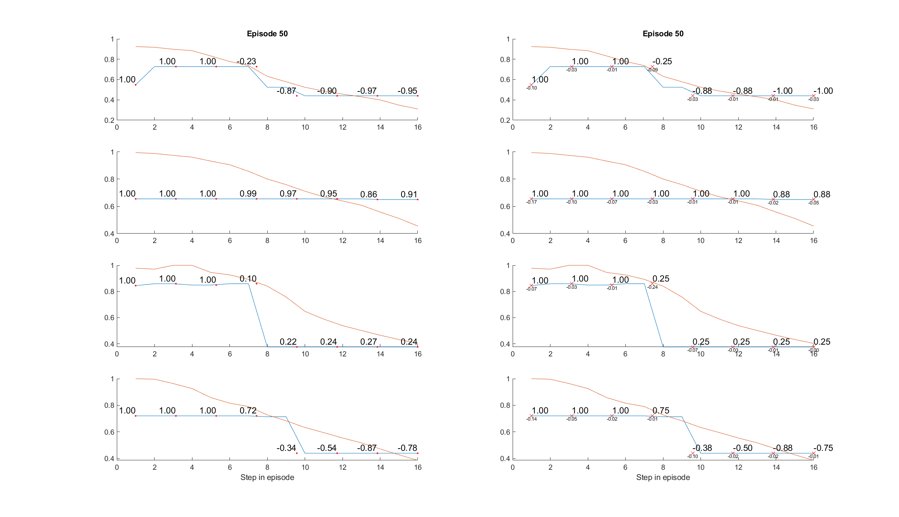
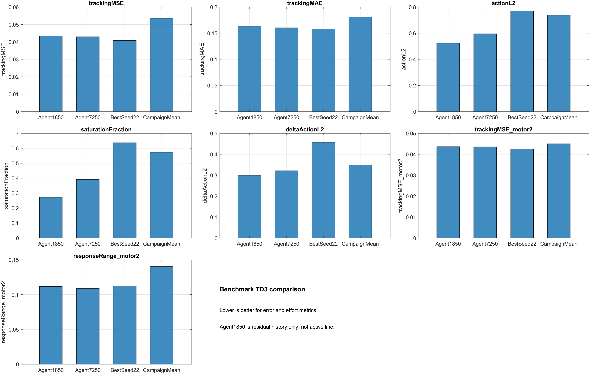

# 1. Resumen ejecutivo

Se entrenó un benchmark base con el algoritmo *Twin Delayed Deep
Deterministic Policy Gradient* (TD3) para controlar cuatro motores
simulados de una prótesis mioeléctrica. El objetivo fue establecer una
línea base reproducible antes de continuar con variantes experimentales o
validaciones físicas. La campaña utilizó cinco semillas, 12000 episodios
por semilla y 60000 episodios acumulados.

El trabajo se ejecutó únicamente en software y simulación, con dataset
pregrabado. No se activó hardware, no se utilizaron puertos COM y los
motores fueron simulados. El resultado agregado fue `Rejected`: ninguna
semilla alcanzó `ConditionA` o `ConditionB`. La campaña tampoco superó de
forma robusta al benchmark histórico `Agent7250`, principalmente por un
tracking medio peor y una saturación mayor. El diagnóstico por motor dejó
al motor 2 como hallazgo técnico a revisar, sin convertirlo en el objetivo
principal de este documento.

# 2. Objetivo del benchmark base

El benchmark base se diseñó para:

1. Repetir el entrenamiento TD3 desde cero con semillas controladas.
2. Mantener una configuración común para todas las semillas.
3. Guardar checkpoints y métricas suficientes para seleccionar un agente.
4. Evaluar el checkpoint seleccionado mediante 50 episodios de test.
5. Comparar el resultado con `Agent7250`, referencia histórica del proyecto.
6. Detectar problemas por motor antes de considerar pruebas físicas.

La campaña no pretendía promover automáticamente un nuevo agente. El
criterio era conservar el nuevo resultado solo si mejoraba el tracking sin
introducir esfuerzo, saturación o respuestas funcionales deficientes.

# 3. Configuración de entrenamiento

La campaña revisada corresponde a:

`Agentes/benchmark_td3_seeded_retrain_motor2_diagnostic/26-05-27_23-44-39/`

| Parámetro | Configuración |
| --- | --- |
| Algoritmo | TD3 base |
| Inicio del agente | Entrenamiento desde cero |
| Estado | `markov52` |
| Reward | `trackingMseActionRateReward` |
| Semillas | `[11 22 33 44 55]` |
| Episodios por semilla | `12000` |
| Episodios acumulados | `60000` |
| Checkpoint | Cada `100` episodios |
| Guardado de episodios | Cada `100` episodios |
| Auditoría rápida | `20` simulaciones |
| Auditoría completa | `50` simulaciones |
| Candidatos completos | `topK = 5` |
| Test final | `50` episodios |
| Dataset | Pregrabado |
| Motores | Simulados |
| `usePrerecorded` | `true` |
| `simMotors` | `true` |
| `connect_glove` | `false` |
| `unifyActions` | `false` |
| Interfaz de acción | `baselineQuantized` |

El entrenamiento utilizó una NVIDIA GeForce RTX 5070 Laptop GPU. El summary
de la campaña registra CUDA Forward Compatibility habilitada, GPU
disponible y GPU activa. Esta aceleración reduce el tiempo de cómputo, pero
no modifica los criterios de selección o aceptación.


# 4. Estado Markov52 usado por el agente

La observación `markov52` contiene 52 valores:

| Componente | Dimensión | Función |
| --- | ---: | --- |
| Características EMG | 40 | Representan la ventana EMG actual |
| Encoder normalizado | 4 | Posición actual de M1-M4 |
| Cambio de encoder | 4 | Diferencia respecto al estado anterior |
| Acción efectiva previa | 4 | Acción aplicada en el paso anterior |
| **Total** | **52** | Entrada del agente TD3 |

Las 40 características EMG se calculan con `getWmoosFeatures` y se
normalizan con los valores del proyecto. Los encoders se normalizan con
divisores `[26500 11500 8500 9000]`. El cambio de encoder y la acción
anterior se limitan a `[-1, 1]`.

`markov52` incorpora información de primer orden mediante el cambio de
posición y la acción previa. No utiliza el apilado de tres ventanas EMG;
esa lógica corresponde a otra variante de observación y no a este
benchmark.

# 5. Función de recompensa

La reward oficial fue `trackingMseActionRateReward`. Para cada motor se
definió el error entre la respuesta simulada y la referencia:

$$
e_i = y_i - r_i
$$

El cambio de acción se calculó respecto al paso anterior:

$$
\Delta a_i = a_i - a_{i,t-1}
$$

La recompensa individual por motor fue:

$$
R_i = -\left(e_i^2 + 0.01a_i^2 + 0.05\Delta a_i^2\right)
$$

La recompensa final fue el promedio de los cuatro motores:

$$
R = \frac{1}{4}\sum_{i=1}^{4} R_i
$$

Donde:

- `e_i` es el error entre respuesta simulada y referencia;
- `a_i` es la acción efectiva aplicada;
- `Δa_i` penaliza cambios bruscos entre pasos;
- `0.01` es el peso del esfuerzo de acción;
- `0.05` es el peso del cambio de acción.

La reward también registra `trackingMSE`, `trackingMAE`, `actionL2`,
`deltaActionL2` y saturación. En esta implementación la saturación se
registra cuando `abs(action) >= 0.95`, pero no añade una penalización
directa a la reward.

Los pesos específicos por motor presentes en configuración pertenecen a
rewards experimentales posteriores. No fueron utilizados por
`trackingMseActionRateReward` y no forman parte del benchmark oficial.

# 6. Parámetros principales

| Grupo | Parámetro | Valor |
| --- | --- | --- |
| Acción | `actionInterfaceVariant` | `baselineQuantized` |
| Acción | `actionCommandLevels` | `[0 64 96 128 160 192 224 255]` |
| Acción | Umbral de activación | `0.05` |
| Acción | PWM máximo M1-M4 | `[255 255 255 255]` |
| Estado | `encoder2state_scale` | `[26500 11500 8500 9000]` |
| Flex | `flexJoined_scale` | `[4092 2046 1023 2046]` |
| Reward | Peso de acción | `0.01` |
| Reward | Peso de cambio de acción | `0.05` |
| Diagnóstico | Umbral de saturación registrado | `0.95` |
| Selección | Auditoría fase A | 20 simulaciones |
| Selección | Auditoría fase B | 50 simulaciones |
| Selección | Candidatos fase B | 5 |

El flujo añadió semillas reproducibles, carpetas separadas por corrida,
checkpoints periódicos, auditoría en dos fases, test visual del checkpoint
seleccionado, métricas por motor, figuras de entrenamiento y summaries
CSV/TXT/MAT. Estas capacidades amplían la evaluación, pero no cambian los
defaults oficiales del benchmark.

# 7. Resultados de entrenamiento

| Estado de campaña | Resultado |
| --- | ---: |
| `ConditionA` | 0 |
| `ConditionB` | 0 |
| `Rejected` | 5 |
| Estado agregado | **Rejected** |
| Mejor semilla | 22 |
| Episodio seleccionado | 6900 |

| Métrica | Media | Desviación estándar |
| --- | ---: | ---: |
| `trackingMSE` | 0.053591 | 0.012110 |
| `trackingMAE` | 0.181093 | 0.022777 |
| `actionL2` | 0.737733 | 0.092318 |
| `saturationFraction` | 0.573518 | 0.117074 |
| `deltaActionL2` | 0.349939 | 0.224863 |

El mejor checkpoint global correspondió a seed 22, episodio 6900. Obtuvo
`trackingMSE = 0.040836`, pero permaneció `Rejected` porque el criterio de
aceptación también considera esfuerzo, saturación y comportamiento por
motor.

El entrenamiento mostró una mejora rápida durante los primeros episodios,
seguida de alta variabilidad entre episodios y semillas. Por esa razón no
se seleccionó simplemente el último checkpoint: cada seed pasó por una
auditoría rápida y luego por una evaluación completa de los mejores
candidatos.

# 8. Evaluación visual del test de 50 episodios

Después de seleccionar un checkpoint por seed se ejecutó un test final de
50 episodios. La figura utilizada corresponde al episodio 50 de seed 22,
el mejor resultado global de la campaña.

La gráfica MATLAB superpone referencia, respuesta simulada y valores de
acción. Una evaluación adecuada debe mostrar que la respuesta acompaña la
tendencia de la referencia sin mantener acciones saturadas de forma
innecesaria.



La evaluación visual mostró seguimiento parcial en los motores, pero
también diferencias de rango y acciones elevadas. Esta lectura complementa
el MSE: una métrica promedio razonable puede ocultar una respuesta casi
plana o una acción alta que produce poco movimiento. M2 quedó identificado
como el motor que requería una revisión adicional.

En fases posteriores se observó que reentrenar desde cero podía degradar
otros motores, por lo que se reforzó la evaluación conjunta M1-M4. Esa
validación posterior no forma parte de los resultados principales de este
benchmark.

# 9. Comparación con Agent7250

| Métrica | Agent7250 | Campaña nueva |
| --- | ---: | ---: |
| `trackingMSE` | 0.043045 | 0.053591 |
| `saturationFraction` | 0.392086 | 0.573518 |
| `trackingMSE_motor2` | 0.043548 | 0.045047 |
| `responseRange_motor2` | 0.108838 | 0.140268 |

La campaña nueva aumentó el rango medio de respuesta de M2, pero empeoró el
tracking global, el tracking de M2 y la saturación. Por este motivo no
reemplaza a `Agent7250`, que se mantiene como referencia histórica.



La figura también incluye `Agent1850` como referencia histórica de otro
experimento. Esa referencia no corresponde a la línea activa y no modifica
la conclusión del benchmark base.

# 10. Hallazgo breve sobre motor 2

El diagnóstico por motor mostró que M2 era el componente más débil del
benchmark base. En tres de las cinco seeds se activaron
`motor2_flat_response` y `motor2_action_no_motion`. La media fue
`trackingMSE_motor2 = 0.045047` y
`responseRange_motor2 = 0.140268`.

Se observó que podía existir acción y movimiento de encoder sin una
respuesta flex útil proporcional. Esto justificó revisar posteriormente la
conversión encoder-flex y los flags funcionales. Esas correcciones
pertenecen a una fase posterior y no forman parte del entrenamiento
benchmark base descrito aquí.

# 11. Conclusión técnica

El benchmark TD3 base se entrenó de forma reproducible con cinco seeds,
12000 episodios por seed y 60000 episodios acumulados. Se incorporaron
checkpoints periódicos, auditoría en dos fases, test final de 50 episodios,
figuras de entrenamiento y métricas globales y por motor.

La campaña no superó a `Agent7250`. Su media presentó mayor
`trackingMSE` y mayor saturación, y las cinco seeds quedaron `Rejected`.
Aunque seed 22 produjo un checkpoint con tracking competitivo, no cumplió
el criterio conjunto de aceptación.

La conclusión es mantener `Agent7250` como referencia histórica y no
promover la nueva campaña como benchmark oficial. El motor 2 queda como
hallazgo técnico a resolver antes de considerar otra campaña extensa o una
validación física.

# 12. Próximo paso sugerido

El siguiente paso debe ser una revisión corta y controlada:

1. Revisar los episodios de test donde M2 presenta respuesta plana.
2. Comparar referencia, respuesta, acción y saturación por motor.
3. Confirmar que cualquier mejora de M2 no degrade M1, M3 o M4.
4. Mantener los defaults del benchmark sin cambios durante el diagnóstico.
5. No activar hardware ni lanzar otra campaña larga hasta obtener
   aceptación conjunta M1-M4.

El trabajo posterior puede estudiar conversión, thresholds o correcciones
locales, pero debe documentarse separado del benchmark base.

# Anexo A. Comandos principales

## A.1 Benchmark base

Desde `matlab_code/`:

```matlab
cd('C:/ruta/al/repo/ProtesisPracticas/EMG_Prosthesis_TD3/matlab_code')
addpath(genpath(pwd))
clearConfigurablesOverride()

results = run_benchmark_td3_seeded_retrain_motor2_diagnostic(struct( ...
    'seeds', [11 22 33 44 55], ...
    'trainingEpisodes', 12000, ...
    'trainingSaveEvery', 100, ...
    'episodeSaveFreq', 100, ...
    'auditFastSimulations', 20, ...
    'auditFullSimulations', 50, ...
    'auditTopK', 5, ...
    'finalTestEpisodes', 50, ...
    'plotEpisodeOnTest', true, ...
    'useGpu', true, ...
    'runMotor2SanityCheck', true));
```

## A.2 Revisión de resultados

```matlab
results.summaryRoot
results.figuresRoot
results.perSeedTable
```

