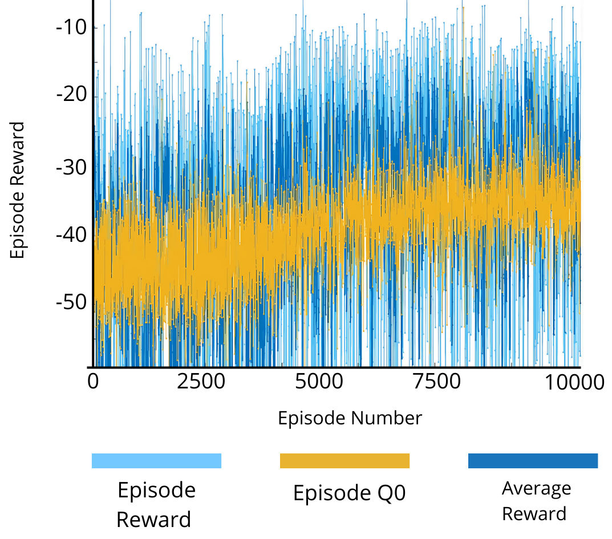
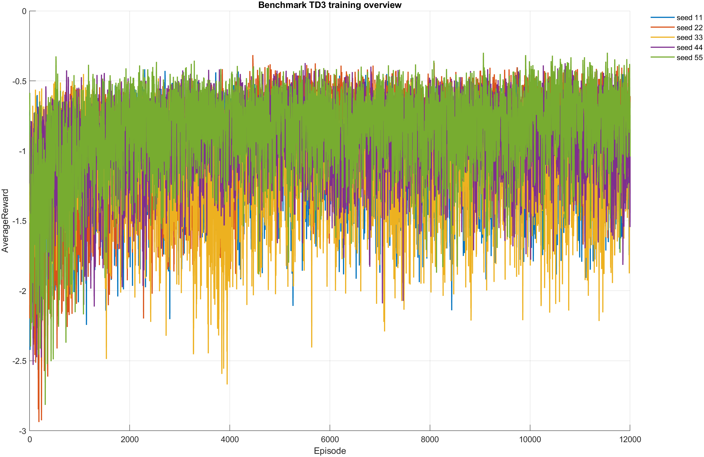

# 1. Contexto: por qué existe un benchmark base

El benchmark base actual no debe interpretarse como el primer modelo del
proyecto, sino como una repetición reproducible y auditada de una línea TD3
que ya existía. El experimento cero demostró la viabilidad de usar TD3 para
mapear características EMG hacia comandos continuos de cuatro motores. En
esa etapa, el agente usaba 40 características EMG y 4 posiciones de
encoder, para un estado de 44 dimensiones, y producía acciones continuas
en el rango `[-1, 1]`, posteriormente escaladas a PWM.

Esa primera línea permitió validar la arquitectura general del entorno, la
extracción de características EMG, la interfaz EMG-motor y una política de
control proporcional en simulación. `Agent7250` quedó después como
referencia histórica operativa del proyecto. Por tanto, aunque cada seed de
la campaña multiseed creó y entrenó un agente nuevo, conceptualmente la
campaña no comenzó desde cero: intentó reproducir, auditar y posiblemente
mejorar una base ya establecida.

# 2. Experimento cero: TD3 inicial del proyecto

El experimento inicial utilizó TD3 para producir control continuo, en lugar
de limitar la prótesis a una clasificación discreta de gestos. Los datos
principales del reporte base son:

| Elemento | Configuración reportada |
| --- | --- |
| Algoritmo | TD3 |
| Objetivo | Control continuo y proporcional de cuatro motores |
| Participantes | 12 |
| Muestras totales | Aproximadamente 7200 |
| Movimientos | Apertura, cierre y pinza |
| Adquisición EMG | Myo armband, 8 canales |
| Características | 5 por canal |
| Características EMG totales | 40 |
| Referencia | Glove/flex reducido a cuatro valores |
| Estado | 44 dimensiones: 40 EMG + 4 encoders |
| Acción | 4 comandos continuos en `[-1, 1]` |
| Salida PWM | `[-255, 255]` |
| Sample time | 0.2 s |
| Entrenamientos descritos | 10k y 100k episodios |

La referencia del glove se utilizó como objetivo de seguimiento, pero no
formaba parte directa de la observación del agente. La observación combinó
intención muscular procesada y realimentación de posición de los motores.

Los hiperparámetros reportados fueron:

| Hiperparámetro | Valor |
| --- | ---: |
| Minibatch size | 256 |
| Experience buffer | `1e6` |
| Actor learning rate | `1e-4` |
| Critic learning rate | `1e-3` |
| Discount factor | 0.95 |
| Noise standard deviation | 0.4 |
| Noise decay rate | `1e-5` |
| Target update frequency | 2 |

Según el reporte base, el entrenamiento se evaluó en fases de 10k y 100k
episodios. La simulación se evaluó durante 48 episodios y alcanzó un MAE
medio de 0.1553, con mínimo de 0.0748 y máximo de 0.2676. Esto equivale a
un error posicional medio aproximado de 15% sobre la escala normalizada.

El experimento cero se enfocó en demostrar que TD3 podía producir una
política de control continuo, no solo reconocer gestos. Su principal
fortaleza fue obtener movimiento proporcional a partir de EMG. Sus
limitaciones fueron la variabilidad entre episodios y las diferencias entre
simulación y operación física.

# 3. Agent7250 como referencia histórica

`Agent7250` representa el benchmark histórico operativo usado como
referencia interna. Su importancia no depende únicamente del número de
episodio, sino de que proporcionó un punto estable para decidir si una
nueva campaña aportaba una mejora real.

En la evaluación comparativa utilizada por la fase actual, sus métricas
fueron:

| Métrica | Agent7250 |
| --- | ---: |
| `trackingMSE` | 0.043045 |
| `saturationFraction` | 0.392086 |
| `trackingMSE_motor2` | 0.043548 |
| `responseRange_motor2` | 0.108838 |

Estas métricas no son directamente equivalentes al MAE del experimento
cero, pero permiten comparar agentes dentro del protocolo actual. En ese
protocolo, `Agent7250` se conserva como benchmark histórico y no debe
confundirse con la campaña multiseed nueva.

# 4. Campaña multiseed actual

La campaña actual entrenó TD3 base desde cero para cada seed, pero lo hizo
con una metodología más reproducible y auditable:

| Parámetro | Valor |
| --- | --- |
| Estado | `markov52` |
| Reward | `trackingMseActionRateReward` |
| Seeds | `[11 22 33 44 55]` |
| Episodios por seed | 12000 |
| Episodios acumulados | 60000 |
| Checkpoint | Cada 100 episodios |
| Auditoría rápida | 20 simulaciones |
| Auditoría completa | 50 simulaciones |
| Candidatos completos | `topK = 5` |
| Test final | 50 episodios |
| Dataset | Pregrabado |
| Motores | Simulados |
| Hardware | No utilizado |
| Interfaz de acción | `baselineQuantized` |

Los resultados agregados fueron:

| Resultado | Valor |
| --- | ---: |
| `ConditionA` | 0 |
| `ConditionB` | 0 |
| `Rejected` | 5 |
| Estado agregado | **Rejected** |
| Mejor seed | 22 |
| Checkpoint seleccionado | Episodio 6900 |
| `trackingMSE` medio | 0.053591 |
| `trackingMAE` medio | 0.181093 |
| `actionL2` medio | 0.737733 |
| `saturationFraction` media | 0.573518 |
| `deltaActionL2` medio | 0.349939 |
| `trackingMSE_motor2` medio | 0.045047 |
| `responseRange_motor2` medio | 0.140268 |
| Flags `flat_response` M2 | 3 |
| Flags `action_no_motion` M2 | 3 |

La campaña añadió semillas reproducibles, checkpoints periódicos,
auditoría en dos fases y test final. Sin embargo, esa mayor formalidad no
se tradujo en una mejora frente a `Agent7250`.

# 5. Comparación de métricas

| Métrica | Experimento cero / TD3 inicial | Agent7250 | Campaña multiseed actual |
| --- | --- | --- | --- |
| Algoritmo | TD3 | TD3 benchmark histórico | TD3 base reproducible |
| Estado | 44 dimensiones | Checkpoint histórico | `markov52` |
| Entrenamiento | 10k y 100k episodios reportados | Checkpoint Agent7250 | 5 seeds x 12000 = 60000 |
| Evaluación | 48 episodios | Evaluación reproducida | 50 episodios por checkpoint |
| Métrica principal | MAE | Tracking y saturación | Tracking, saturación y flags |
| MAE medio | 0.1553 | No disponible | `trackingMAE = 0.181093` |
| MAE mínimo | 0.0748 | No disponible | No disponible |
| MAE máximo | 0.2676 | No disponible | No disponible |
| `trackingMSE` global | No reportado | 0.043045 | 0.053591 |
| `saturationFraction` | No reportado | 0.392086 | 0.573518 |
| `trackingMSE_motor2` | No reportado | 0.043548 | 0.045047 |
| `responseRange_motor2` | No reportado | 0.108838 | 0.140268 |
| Estado final | Base funcional/proporcional | Referencia histórica | Rejected |

La comparación no es completamente uno a uno. El experimento cero reportó
principalmente MAE, mientras que la fase actual utiliza trackingMSE,
saturación y flags por motor. Aun así, la tabla ubica la evolución del
proyecto: el experimento cero demostró viabilidad, `Agent7250` quedó como
benchmark interno y la campaña multiseed intentó reproducir y mejorar esa
base con mayor control experimental.

La comparación directa bajo el protocolo actual es:

| Métrica | Agent7250 | Campaña nueva | Lectura |
| --- | ---: | ---: | --- |
| `trackingMSE` | 0.043045 | 0.053591 | Empeora en la campaña |
| `saturationFraction` | 0.392086 | 0.573518 | Mayor saturación |
| `trackingMSE_motor2` | 0.043548 | 0.045047 | Leve empeoramiento |
| `responseRange_motor2` | 0.108838 | 0.140268 | Mayor rango, insuficiente |
| Estado | Referencia | Rejected | No reemplaza el benchmark |

La campaña nueva logró mayor rango medio de M2, pero a costa de peor
tracking global y mayor saturación. Por ello no reemplaza a `Agent7250`.

# 6. Lectura técnica de la comparación

El experimento cero debe entenderse como la prueba de viabilidad de TD3
para control continuo. Su métrica central fue MAE, con un error medio
aproximado de 15%. `Agent7250` representa una instancia posterior más útil
como referencia interna, evaluada con métricas de tracking y saturación. La
campaña multiseed actual mejoró la trazabilidad del proceso, pero no el
desempeño final.

Entrenar más episodios o repetir el entrenamiento desde cero no garantiza
una política mejor. Aunque la campaña nueva acumuló 60000 episodios y
mejoró la reproducibilidad del análisis, presentó mayor error global y
mayor saturación frente a `Agent7250`. Por ello, `Agent7250` debe
mantenerse como benchmark mientras se estudian mejoras puntuales.

El motor 2 quedó como hallazgo técnico porque la campaña nueva mantuvo
flags de respuesta plana y acción sin movimiento. Ese diagnóstico pertenece
a fases posteriores y no domina esta comparación histórica.

# 7. Figuras recomendadas

La Figura 1 fue extraída directamente de `Fuertes_etal(base).pdf`. Las
Figuras 2 y 3 fueron generadas por MATLAB durante la campaña multiseed
actual.

# 8. Conclusión

El benchmark base actual debe interpretarse como una revisión reproducible
del agente histórico, no como el origen completo del proyecto. El
experimento cero estableció que TD3 podía generar control proporcional a
partir de EMG, con MAE medio cercano al 15% en simulación. `Agent7250`
quedó como referencia interna más sólida.

Frente a esa referencia, la campaña multiseed actual no logró reemplazo:
`Agent7250` obtuvo `trackingMSE = 0.043045` y
`saturationFraction = 0.392086`, mientras que la campaña nueva obtuvo
`trackingMSE` medio de 0.053591 y `saturationFraction` media de 0.573518.
Aunque la campaña aumentó `responseRange_motor2` de 0.108838 a 0.140268,
también empeoró `trackingMSE_motor2` de 0.043548 a 0.045047 y mantuvo flags
funcionales en M2.

Por tanto, la campaña multiseed aportó reproducibilidad, auditoría y
diagnóstico por motor, pero no superó al benchmark histórico. La conclusión
es mantener `Agent7250` como referencia base y utilizar la campaña nueva
como evidencia diagnóstica para orientar mejoras puntuales.

