# Motor 2 Conversion Fix Report

## A. Resumen ejecutivo

Se implemento una fase experimental llamada `Motor 2 encoder2Flex
calibration + all-motor regression check`. La meta fue revisar si el bajo
rango util del motor 2 viene de la conversion `encoder2Flex` y no seguir
ajustando reward sin aislar primero la causa.

El cambio no reemplaza el default oficial. El sistema sigue usando
`encoder2FlexVariant="baseline"` por defecto. La variante
`motor2Calibrated` queda solo como experimento de simulacion.

Resultado principal: la variante reduce la zona plana baja de motor 2 en el
diagnostico sin entrenamiento y no cambia M1, M3 ni M4. Sin embargo, la
ablation corta de 500 episodios no cumplio criterios para promoverla,
porque no elimino los flags ni subio de forma clara `responseRange_motor2`.

## B. Estado previo

La fase anterior mostro que motor 2 no parece estar completamente mal
indexado. El encoder si responde, pero la salida util aparece despues de
cierto umbral:

| Accion | PWM | encoderRange | encoder2FlexRange | normalizedFlexRange |
| ---: | ---: | ---: | ---: | ---: |
| 0.25 | 64 | 3598.000 | 0.000 | 0.000000 |
| 0.50 | 128 | 6113.833 | 359.688 | 0.175801 |
| 1.00 | 255 | 6665.167 | 440.176 | 0.215140 |

Esto apuntaba a una zona muerta entre encoder y flex, no a reward como
primera causa. La reward ponderada redujo error, pero no mejoro rango ni
flags.

## C. Variante experimental

Se agrego:

```matlab
encoder2FlexVariant = "baseline"
encoder2FlexVariant = "motor2Calibrated"
```

La variante `motor2Calibrated` baja solo el umbral `gap` del motor 2. El
primer intento uso:

```matlab
motor2Encoder2FlexGapOffset = -128
motor2Encoder2FlexBreakOffset = 0
motor2Encoder2FlexMinEffectiveEncoder = 0
```

Despues se hizo un barrido de limites y se selecciono `-64` como candidato
mas conservador. No se cambio `definitions.m`. No se cambiaron los limites
oficiales. No se cambiaron puertos ni hardware. La correccion se activa
solo por override.

## D. Diagnostico before/after

Comando usado:

```matlab
results = run_motor2_conversion_fix_diagnostic(struct( ...
    'encoder2FlexVariant', ["baseline", "motor2Calibrated"], ...
    'initialMode', 'all'));
```

Resultados guardados en:

```text
Agentes/motor2_conversion_fix_diagnostic/26-06-09_01-24-25/
```

Resumen por motor:

| Motor | Range baseline | Range calibrado | Cambio % | Signo ok | Regresion |
| --- | ---: | ---: | ---: | --- | --- |
| M1 | 0.210989 | 0.210989 | 0.000 | si | no |
| M2 | 0.226875 | 0.227364 | 0.216 | si | no |
| M3 | 0.294546 | 0.294546 | 0.000 | si | no |
| M4 | 0.209136 | 0.209136 | 0.000 | si | no |

En motor 2 desde `home`, la accion baja `0.25` dejo de quedar totalmente
plana:

| Variante | Accion | PWM | encoderRange | encoder2FlexRange | normalizedFlexRange |
| --- | ---: | ---: | ---: | ---: | ---: |
| baseline | 0.25 | 64 | 3598.000 | 0.000 | 0.000000 |
| motor2Calibrated | 0.25 | 64 | 3598.000 | 10.917 | 0.005336 |
| baseline | 0.50 | 128 | 6113.833 | 359.688 | 0.175801 |
| motor2Calibrated | 0.50 | 128 | 6113.833 | 372.304 | 0.181967 |

Lectura: el aplanamiento estaba en la etapa `encoder2Flex`, porque el
encoder se movia pero el flex crudo quedaba en cero. La calibracion baja el
umbral y recupera una salida pequena en la zona baja.

Figuras:

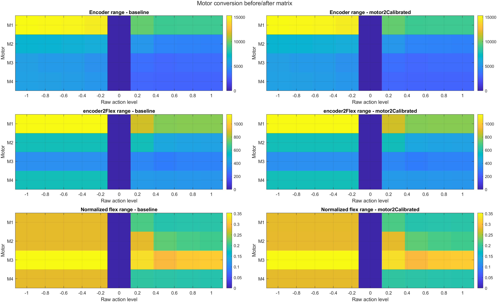

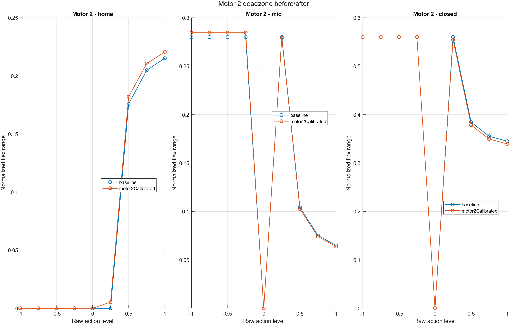

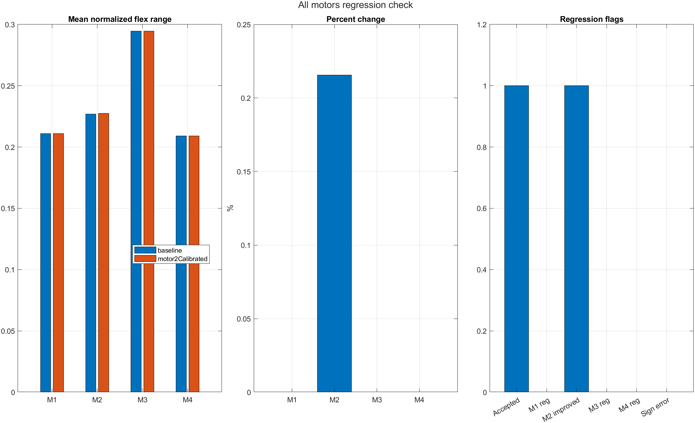

## E. Regression check de motores 1, 3 y 4

La comparacion all-motor marco:

| Flag | Valor |
| --- | --- |
| motor1_regression | false |
| motor3_regression | false |
| motor4_regression | false |
| motor2_improved | true |
| sign_error_detected | false |
| calibration_accepted | true |

Como diagnostico de conversion, la variante es aceptable: no rompe otros
motores y no invierte signo. Esto no significa que ya sea buena para
entrenamiento.

## F. Ablation corta

Comando usado:

```matlab
results = run_motor2_conversion_fix_ablation(struct( ...
    'seeds', [11 55], ...
    'trainingEpisodes', 500, ...
    'finalTestEpisodes', 5, ...
    'useGpu', true));
```

Resultados guardados en:

```text
Agentes/motor2_conversion_fix_ablation/26-06-09_01-25-47/
```

Tabla agregada:

| Config | MSE | MAE | MSE M2 | Range M2 | Saturacion | Flat | No-motion | Aceptada |
| --- | ---: | ---: | ---: | ---: | ---: | ---: | ---: | --- |
| baseline + conversion baseline | 0.099748 | 0.257544 | 0.112913 | 0.170200 | 0.169857 | 1 | 0 | no |
| baseline + conversion calibrada | 0.102556 | 0.259969 | 0.098362 | 0.137716 | 0.149650 | 2 | 1 | no |
| accion calibrada + conversion baseline | 0.092527 | 0.252928 | 0.070589 | 0.167690 | 0.053934 | 1 | 1 | no |
| accion calibrada + conversion calibrada | 0.092789 | 0.247711 | 0.095213 | 0.169227 | 0.004167 | 1 | 0 | no |

La mejor saturacion fue `accion calibrada + conversion calibrada`
(`0.004167`). La mejor `trackingMSE_motor2` fue `accion calibrada +
conversion baseline` (`0.070589`). Ninguna configuracion fue aceptada,
porque no hubo mejora conjunta de rango, flags, tracking global y motor 2.

Se repitio despues el smoke con `gapOffset=-256` y
`selectionMode="motor2_final_gate"`:

```text
Agentes/motor2_conversion_fix_ablation/26-06-18_02-49-24/
```

| Config | MSE | MAE | MSE M2 | Range M2 | Saturacion | Flat | No-motion | Aceptada |
| --- | ---: | ---: | ---: | ---: | ---: | ---: | ---: | --- |
| baseline + conversion baseline | 0.099748 | 0.257544 | 0.112913 | 0.170200 | 0.169857 | 1 | 0 | no |
| baseline + conversion motor2Calibrated | 0.092616 | 0.244126 | 0.078885 | 0.181432 | 0.133639 | 0 | 0 | si |
| accion calibrada + conversion baseline | 0.092527 | 0.252928 | 0.070589 | 0.167690 | 0.053934 | 1 | 1 | no |
| accion calibrada + conversion motor2Calibrated | 0.075777 | 0.221005 | 0.078055 | 0.172212 | 0.108406 | 1 | 1 | no |

Con este offset, la combinacion `baselineQuantized + motor2Calibrated` paso
el smoke centrado en motor 2. Frente al baseline, bajo el MSE global, bajo
el MSE de motor 2, subio el rango de motor 2 y elimino los flags en el
smoke corto. Esa aceptacion quedo revocada por la validacion all-motor
posterior. La accion calibrada no se promovio porque aun dejo flags.

Figuras:

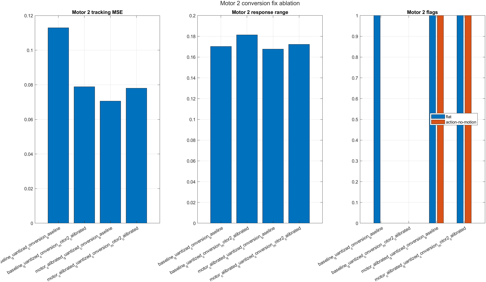

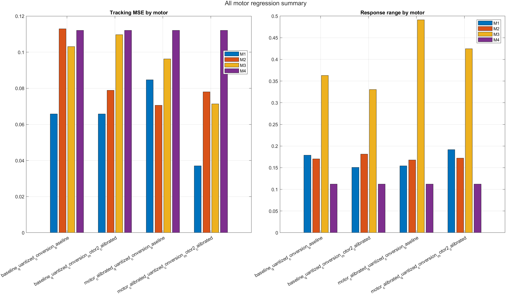

## G. Barrido de limites

Se ejecuto un barrido sin entrenamiento para evitar elegir el offset de
`gap.idx` a mano:

```matlab
results = run_motor2_encoder2flex_limit_sweep_diagnostic(struct( ...
    'gapOffsets', [0 -32 -64 -96 -128 -192 -256], ...
    'breakOffsets', 0, ...
    'initialMode', 'all'));
```

Resultados guardados en:

```text
Agentes/motor2_encoder2flex_limit_sweep/26-06-09_22-50-26/
```

Tabla resumida:

| Candidato | gap.idx exp. | Range M2 | Low action M2 | Max deviation | Aceptado |
| --- | ---: | ---: | ---: | ---: | --- |
| baseline | 3650 | 0.226875 | 0.000000 | 0.000000 | no |
| gapOffset -32 | 3618 | 0.227048 | 0.000000 | 0.001560 | si |
| gapOffset -64 | 3586 | 0.227189 | 0.000849 | 0.003108 | si |
| gapOffset -96 | 3554 | 0.227277 | 0.003102 | 0.004643 | si |
| gapOffset -128 | 3522 | 0.227364 | 0.005336 | 0.006166 | si |

El candidato seleccionado fue `gapOffset=-64`, porque es el offset mas
conservador que recupera respuesta util para accion baja `0.25` desde
`home`. `gapOffset=-32` fue aceptado por regression check, pero no recupero
esa accion baja.

Figuras:

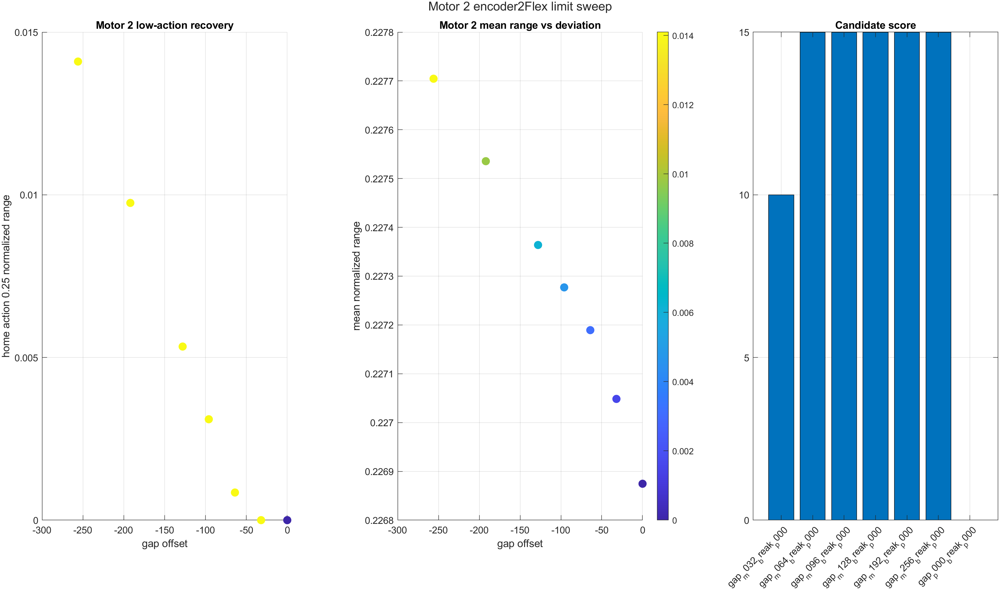

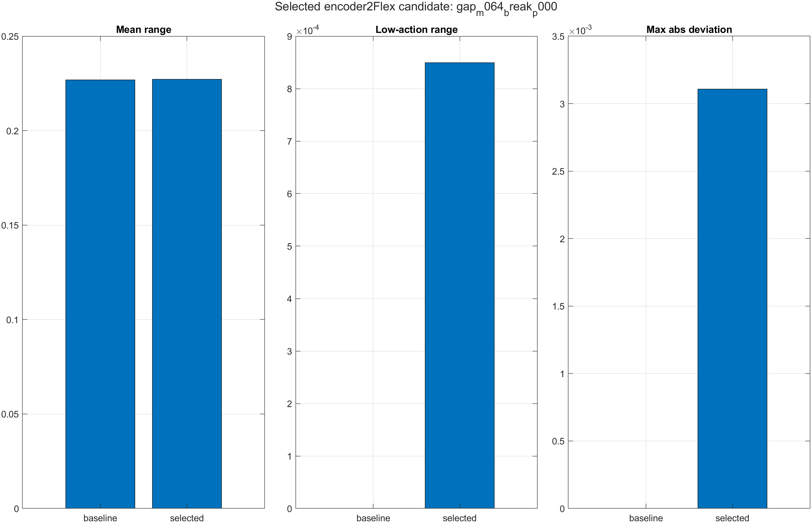

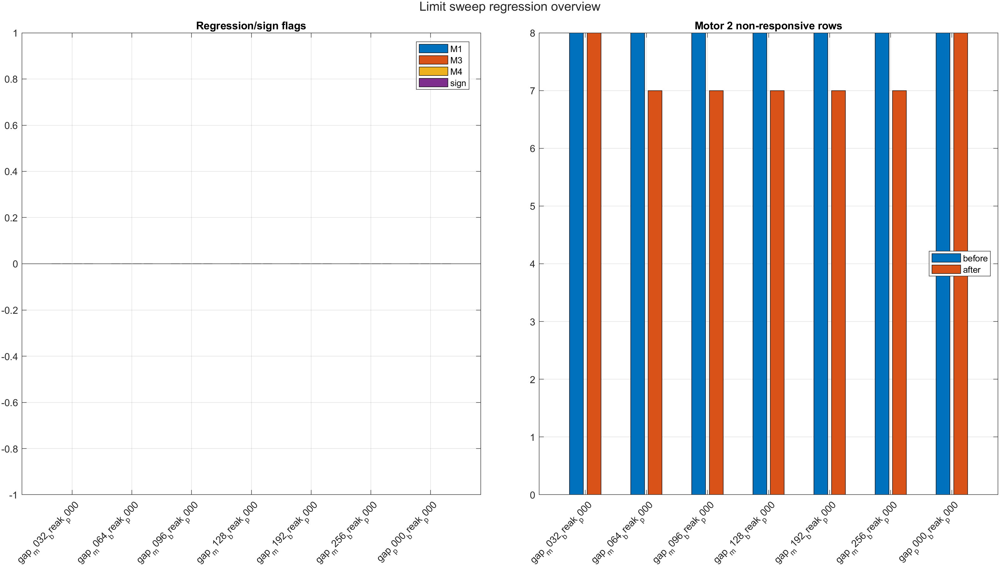

## H. Validacion all-motor de la corrida mediana

Se reviso la corrida:

```text
Agentes/motor2_conversion_fix_ablation/26-06-18_09-04-57/
```

La comparacion correcta ya no fue solo motor 2. Se comparo
`baselineQuantized + baseline` contra `baselineQuantized +
motor2Calibrated` para M1-M4.

| Motor | MSE baseline | MSE cal | Range baseline | Range cal | Sat baseline | Sat cal | Flat B/Cal | No-motion B/Cal | Regresion |
| --- | ---: | ---: | ---: | ---: | ---: | ---: | ---: | ---: | --- |
| M1 | 0.049273 | 0.046642 | 0.158289 | 0.184793 | 0.110094 | 0.410934 | 2/1 | 1/1 | si |
| M2 | 0.087531 | 0.071070 | 0.155809 | 0.160425 | 0.109722 | 0.105740 | 1/1 | 0/0 | no |
| M3 | 0.118077 | 0.120305 | 0.428794 | 0.441262 | 0.137444 | 0.090938 | 0/0 | 0/0 | no |
| M4 | 0.073825 | 0.070127 | 0.149345 | 0.151670 | 0.309727 | 0.415941 | 2/3 | 2/3 | si |

Motor 2 mejora en MSE y rango, pero M1 aumenta saturacion de forma fuerte.
Motor 4 no empeora en MSE ni rango promedio, pero si empeora en saturacion
y en flags. Visualmente aparece el caso importante: acciones altas o
saturadas con respuesta casi plana.

Por eso `motor2Calibrated` no queda aceptada como fix. La fase cambia a:
`Motor 2 fix + all-motor regression validation`.

Se agrego la bandera `high_action_flat_response_motorK` y el selector
`all_motor_final_gate` queda estricto. Si ningun checkpoint pasa todos los
motores, se selecciona el menos malo solo para diagnostico y se reporta
`finalGateAccepted=false`.

La auditoria all-motor generada el `2026-06-19` separo dos efectos:

- En sanity controlado, M4 tiene zona muerta/asimetria, pero sus metricas
  son iguales con `encoder2FlexVariant="baseline"` y
  `"motor2Calibrated"`. Esto indica que la conversion local de motor 2 no
  altera directamente el actuador M4.
- En checkpoints entrenados, M4 si falla visualmente y metricamente. En
  `baseline + motor2Calibrated`, seeds 22 y 55 activan
  `high_action_flat_response_motor4`, con saturacion alta y respuesta baja.

La comparacion contra Agent7250 refuerza esta lectura: Agent7250 queda con
M4 sin flags en 20 episodios (`trackingMSE_motor4=0.030795`,
`responseRange_motor4=0.198918`, `saturationFraction_motor4=0.278977`).
Por tanto, M4 no parece ser solo un defecto inevitable del simulador; hay
un problema de entrenamiento, seleccion de checkpoint o reward que permite
motores planos con acciones altas.

### Validacion corta all-motor, 2026-06-22

Se ejecuto una validacion corta con seeds `[11 55]`, `300` episodios,
test final de `5` episodios, `auditTopK=4`, `gapOffset=-256` y
`selectionMode="all_motor_final_gate"`:

```text
Agentes/motor2_conversion_fix_ablation/26-06-22_09-21-51/
```

| Motor | MSE baseline | MSE cal | Range baseline | Range cal | Sat baseline | Sat cal | Flat B/Cal | No-motion B/Cal | High-action-flat B/Cal |
| --- | ---: | ---: | ---: | ---: | ---: | ---: | ---: | ---: | ---: |
| M1 | 0.066164 | 0.080685 | 0.142948 | 0.152240 | 0.004167 | 0.004167 | 1/1 | 1/1 | 0/0 |
| M2 | 0.141460 | 0.100132 | 0.130941 | 0.169585 | 0.020833 | 0.016667 | 2/0 | 0/0 | 0/0 |
| M3 | 0.101131 | 0.102842 | 0.370884 | 0.387618 | 0.000000 | 0.000000 | 0/0 | 0/0 | 0/0 |
| M4 | 0.112090 | 0.112090 | 0.112263 | 0.112263 | 0.369231 | 0.000000 | 2/2 | 2/2 | 1/0 |

La lectura fue mixta. `baselineQuantized + motor2Calibrated` mejora M2:
MSE baja `0.141460 -> 0.100132`, rango sube `0.130941 -> 0.169585` y los
flags de M2 quedan `0`. Tambien baja la saturacion global
`0.100641 -> 0.006250` y elimina `high_action_flat` en M4.

Pero no pasa all-motor. M1 empeora en MSE (`0.066164 -> 0.080685`) y M4
sigue con `flat 2/2` y `action-no-motion 2/2`. Todas las configuraciones
quedaron con `acceptedConversion=0`, y todas las seeds usaron fallback:
`fallback_diagnostic_no_checkpoint_passed_all_motor_gate`.

Conclusion: existe mejora diagnostica, pero no mejora aceptable. La
calibracion no se promueve.

## I. Veredicto

La zona plana inicial de motor 2 esta en la conversion `encoder2Flex`. El
encoder se mueve, pero la conversion lo deja debajo del umbral `gap.idx`.
La variante `motor2Calibrated` corrige parcialmente esa zona baja, pero la
validacion mediana mostro regresion all-motor, sobre todo en M1 por
saturacion y en M4 por saturacion/flags. El candidato conservador inicial
fue `gapOffset=-64`, pero el smoke de entrenamiento aceptado uso
`gapOffset=-256` y luego fue rechazado por la validacion M1-M4.

No se recomienda promover la variante como default para entrenamientos desde
cero. La reward ponderada, la accion calibrada, Residual Lift y stop-band
siguen pausados.

## J. Plan siguiente

1. Mantener `Agent7250` como base congelada para aislar cambios.
2. Probar correcciones que solo puedan modificar motor 2.
3. Usar `selectionMode="all_motor_final_gate"` para bloquear regresiones en
   M1-M4 cuando se evalue cualquier checkpoint entrenado.
4. Mantener `motorCalibratedQuantized` como experimento futuro.
5. No volver a Residual Lift ni stop-band hasta que M1-M4 tengan rango,
   saturacion y flags estables.

## K. Frozen Agent7250 + correccion aislada de motor 2

Se confirmo que las ablations anteriores entrenaban TD3 desde cero.
`newTraining=true` crea un agente nuevo en `trainInterface`, y
`run_benchmark_td3_seeded_retrain_motor2_diagnostic` usaba `Agent7250`
como benchmark historico, no como politica congelada.

La evaluacion final se ejecuto sin aprendizaje y con 50 episodios:

```text
Agentes/agent7250_frozen_conversion_evaluation/26-06-23_09-38-15/
```

| Config | MSE | MSE M2 | Range M2 | M2 flags | MSE M4 | Range M4 | M4 flags | Aceptada | Motivo |
| --- | ---: | ---: | ---: | ---: | ---: | ---: | ---: | --- | --- |
| Agent7250 baseline | 0.037229 | 0.042474 | 0.109618 | 3 | 0.026250 | 0.231700 | 0 | no | baseline_reference |
| Agent7250 + motor2Calibrated 0 | 0.037229 | 0.042474 | 0.109618 | 3 | 0.026250 | 0.231700 | 0 | no | motor2_acceptance_failed |
| Agent7250 + motor2Calibrated -64 | 0.037113 | 0.041993 | 0.110996 | 3 | 0.026250 | 0.231700 | 0 | no | m2_metrics_improved_but_flags_remain |
| Agent7250 + motor2Calibrated -128 | 0.037003 | 0.041534 | 0.112352 | 3 | 0.026250 | 0.231700 | 0 | no | m2_metrics_improved_but_flags_remain |
| Agent7250 + motor2Calibrated -256 | 0.036800 | 0.040681 | 0.115000 | 3 | 0.026250 | 0.231700 | 0 | no | m2_metrics_improved_but_flags_remain |

La conversion no degrado M4 cuando `Agent7250` quedo congelado. La
regresion vista antes en M4 aparece ligada al entrenamiento desde cero,
selector o reward, no a la conversion local de motor 2 por si sola. Aun
asi, la variante no se acepta: M2 mejora en MSE/rango, pero conserva 3
flags.

Tambien se evaluo una correccion heuristica que solo puede cambiar
`action(2)`. M1, M3 y M4 quedaron iguales a la politica base:
`maxNonMotor2ActionDelta=0`.

```text
Agentes/agent7250_motor2_only_correction_evaluation/26-06-23_09-28-45/
```

| Config | MSE | MSE M2 | Range M2 | M2 flags | MSE M4 | Range M4 | M4 flags | non-M2 delta | Aceptada | Motivo |
| --- | ---: | ---: | ---: | ---: | ---: | ---: | ---: | ---: | --- | --- |
| Agent7250 baseline | 0.037229 | 0.042474 | 0.109618 | 3 | 0.026250 | 0.231700 | 0 | 0 | no | baseline_reference |
| Agent7250 + motor2Calibrated -256 | 0.036800 | 0.040681 | 0.115000 | 3 | 0.026250 | 0.231700 | 0 | 0 | no | m2_metrics_improved_but_flags_remain |
| Agent7250 + M2 heuristic | 0.037127 | 0.042015 | 0.110570 | 3 | 0.025986 | 0.231700 | 0 | 0 | no | m2_metrics_improved_but_flags_remain |
| Agent7250 + M2 heuristic + motor2Calibrated -256 | 0.036692 | 0.040224 | 0.115923 | 3 | 0.025986 | 0.231700 | 0 | 0 | no | m2_metrics_improved_but_flags_remain |

Veredicto: la ruta correcta sigue siendo `Frozen Agent7250 + motor 2
isolated correction`, pero el candidato actual queda rechazado. La
correccion aislada preserva M1, M3 y M4 y mejora metricas de M2, pero no
limpia los flags de M2. No se acepta el fix global entrenado desde cero. No
se promueve `motorCalibratedQuantized` ni `motor2Calibrated` como default.

Figuras curadas:

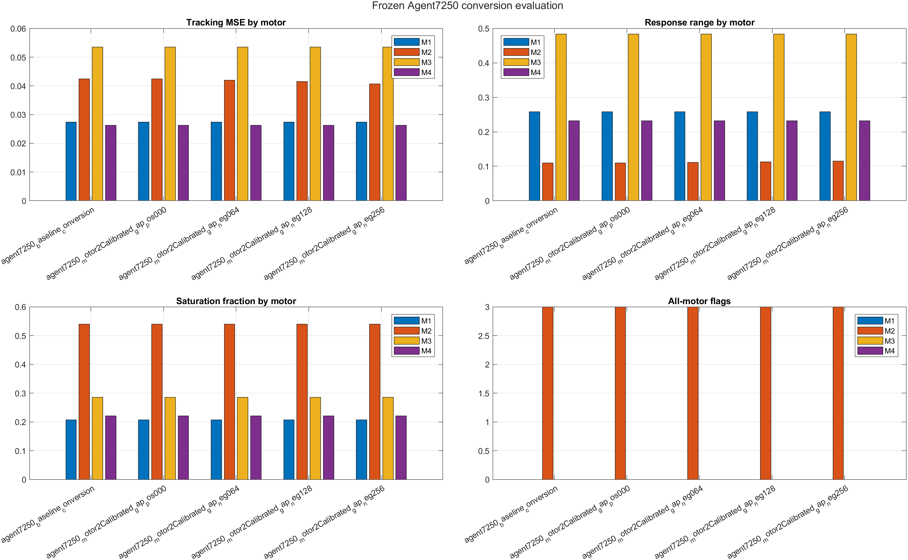

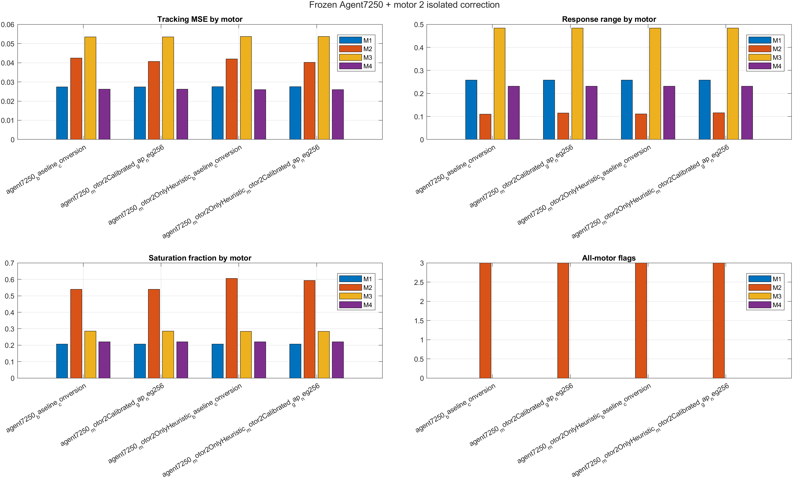

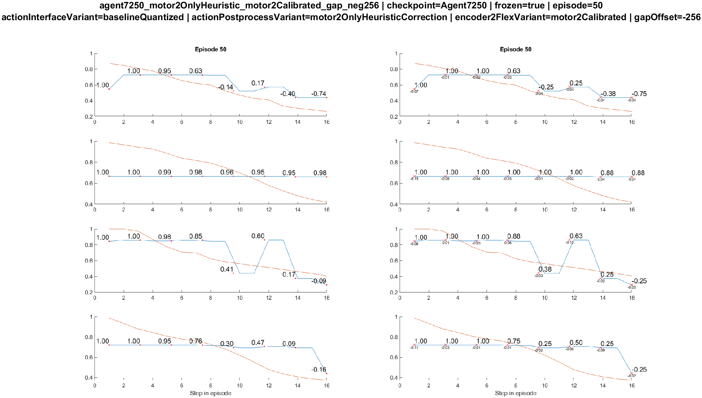

## L. Motor 2 flag forensic audit

Para explicar los flags restantes se agrego una auditoria por episodio. No
hubo entrenamiento; se uso `Agent7250` congelado y el mismo protocolo de 50
episodios:

```text
Agentes/motor2_flag_forensic_audit/26-06-23_12-40-46/
```

| Config | Total flags M2 | Episodios con flags | Flat | No-motion | High-action-flat | Posibles falsos positivos | Delta no-M2 | Decision |
| --- | ---: | ---: | ---: | ---: | ---: | ---: | ---: | --- |
| Agent7250 baseline | 81 | 27 | 27 | 27 | 27 | 0 | 0 | rejected |
| Agent7250 + motor2Calibrated -256 | 78 | 26 | 26 | 26 | 26 | 0 | 0 | rejected |
| Agent7250 + M2 heuristic | 81 | 27 | 27 | 27 | 27 | 0 | 0 | rejected |
| Agent7250 + M2 heuristic + motor2Calibrated -256 | 78 | 26 | 26 | 26 | 26 | 0 | 0 | rejected |

Episodios con flags en baseline:
`2;4;6;8;10;11;12;14;16;18;20;22;24;26;28;30;32;34;36;38;40;42;44;46;48;49;50`.

Episodios con flags con conversion calibrada:
`2;4;6;8;10;11;12;14;16;18;20;22;24;26;28;30;32;34;36;38;40;42;44;46;48;50`.

El cambio `motor2Calibrated -256` elimina solo el episodio 49 de la lista
de flags y baja el conteo total de `81` a `78`. La heuristica aislada
aumenta la accion de M2 (`meanAbsMotor2ActionDelta=0.035457` en baseline y
`0.036039` con conversion calibrada), pero no limpia mas episodios. La
integridad de accion si pasa: `maxNonMotor2ActionDelta=0` en todas las
configuraciones.

La columna `possibleFalsePositive` no marco casos. Los episodios con flags
tienen target de M2 con rango claro y respuesta baja. En baseline, el
promedio de episodios marcados fue:

- `meanTargetRange_M2_flagged = 0.475309`
- `meanResponseRange_M2_flagged = 0.019729`
- `meanActionRange_M2_flagged = 0.097316`

En `M2 heuristic + motor2Calibrated -256`:

- `meanTargetRange_M2_flagged = 0.469810`
- `meanResponseRange_M2_flagged = 0.014281`
- `meanActionRange_M2_flagged = 0.150830`

La sensibilidad de thresholds muestra que el problema no desaparece al
relajar la regla. Con thresholds relajados quedan `25` episodios marcados
por configuracion; con respuesta estricta suben a `40-43`. Por eso el
siguiente paso no es aceptar el candidato ni entrenar una campana larga, sino
entender por que esos episodios tienen target alto, accion presente y
respuesta plana.

Figuras generadas por MATLAB:

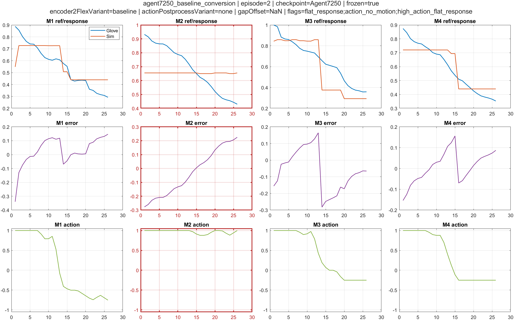

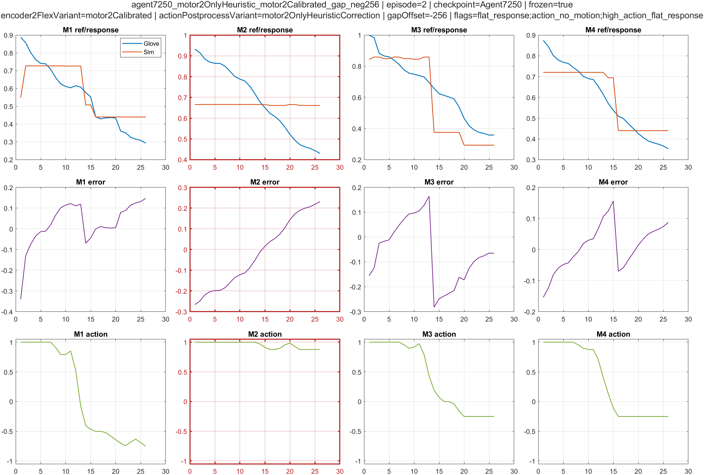

Veredicto forense: `rejected`. La correccion aislada se mantiene como
direccion tecnica porque no altera M1/M3/M4, pero el candidato actual no se
acepta. Los flags de M2 parecen reales bajo la metrica actual y requieren
otra revision de zona plana/conversion o de la heuristica, no una nueva
campana TD3 desde cero.

## M. Comandos para repetir

Diagnostico sin entrenamiento:

```matlab
results = run_motor2_conversion_fix_diagnostic(struct( ...
    'encoder2FlexVariant', ["baseline", "motor2Calibrated"], ...
    'initialMode', 'all'));
```

Barrido de limites:

```matlab
results = run_motor2_encoder2flex_limit_sweep_diagnostic(struct( ...
    'gapOffsets', [0 -32 -64 -96 -128 -192 -256], ...
    'breakOffsets', 0, ...
    'initialMode', 'all'));
```

Ablation corta:

```matlab
results = run_motor2_conversion_fix_ablation(struct( ...
    'seeds', [11 55], ...
    'trainingEpisodes', 300, ...
    'finalTestEpisodes', 5, ...
    'auditTopK', 8, ...
    'selectionMode', 'all_motor_final_gate', ...
    'useGpu', true));
```

Visual review de la corrida mediana:

```matlab
results = run_all_motor_visual_comparison_from_run(struct( ...
    'runRoot', 'Agentes/motor2_conversion_fix_ablation/26-06-18_09-04-57', ...
    'configsToCompare', ["baseline_quantized_conversion_baseline", ...
                         "baseline_quantized_conversion_motor2_calibrated"], ...
    'seeds', [11 22 55]));
```

Sanity all-motor sin entrenamiento:

```matlab
results = run_all_motor_actuation_sanity_check_extended(struct( ...
    'initialMode', 'all', ...
    'encoder2FlexVariant', ["baseline", "motor2Calibrated"]));
```

Test visual de un checkpoint seleccionado:

```matlab
runCheckpointTest(selectedCheckpointPath, 5, true, struct( ...
    'encoder2FlexVariant', 'motor2Calibrated'));
```

Evaluacion congelada de Agent7250:

```matlab
results = run_agent7250_frozen_conversion_evaluation(struct( ...
    'gapOffsets', [0 -64 -128 -256], ...
    'finalTestEpisodes', 50, ...
    'plotEpisodeOnTest', true, ...
    'useGpu', true));
```

Correccion aislada de motor 2:

```matlab
results = run_motor2_only_correction_evaluation(struct( ...
    'mode', 'heuristic', ...
    'gapOffset', -256, ...
    'finalTestEpisodes', 50, ...
    'plotEpisodeOnTest', true, ...
    'useGpu', true));
```
