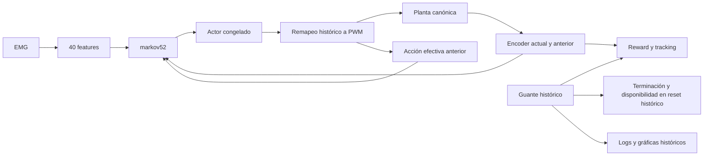

# E2A — auditoría causal de ejecución sin guante

**E2A_RESULT = PASS.** En 20 episodios development, retirar el guante o invertir su
trayectoria temporal deja exactamente iguales los estados, acciones raw, acciones
efectivas, PWM y posiciones de encoder durante el horizonte común. El contrafactual
cambia el reward en los 20 episodios. Pasan **37/37 tests: 13 E2A y 24 E0P**.

Esto valida la arquitectura **glove-supervised training + glove-free execution**.
No se ha entrenado TD3 ni evaluado su calidad de control. E2B y RL siguen sin autorización.

## Recepción y auditoría antes de implementar

- Fecha: 2026-09-05. Rama: `experiment/no-glove-paired-reference-td3`.
- Worktree registrado: `C:\Users\Cesarbmm\ProtesisPracticas_paired_reference`.
- HEAD inicial y remoto tras fetch: `c08b784bf4759c70a9bc2d10f0b44f638a61526a`;
  sincronización inicial `0 0`, E0P cerrada.
- Único residuo local previo: `src/@SimController/.fuse_hidden0000000900000001`,
  sin seguimiento. Se conserva y se excluye del commit E2A.
- Se auditó el código antes de escribir la implementación y el preregistro antes
  de las comparaciones causales: [PREREGISTRO_E2A.md](PREREGISTRO_E2A.md).
- La comparación con `main` local `6b213ba5c624fffb3f1094585c67d9c8ac43b737`
  confirma que `src/@Env`, `src/reward_functions` y `agents/agentTd3.m` no cambiaron
  entre main y el inicio de E2A. E2A tampoco modifica esos archivos.

## Mapa causal de main

Las rutas y líneas siguientes son relativas a `matlab_code/` y describen el código
histórico de la observación markov52 y la interfaz baselineQuantized auditadas.

| Destino | ¿Consume guante? | Evidencia y alcance |
|---|---|---|
| Observación markov52 | No | `src/@Env/calculateState.m:15–27`: features de EMG, encoder, delta encoder y acción efectiva anterior. |
| Entrada del actor | No | `agents/agentTd3.m:95–104`: una entrada `observation`; `src/@Env/loop.m:39` pasa la observación. El checkpoint cargado confirma 52→4. |
| Entrada de ambos críticos | No directamente | `agents/agentTd3.m:39,45,67,73,167`: observación y acción. Reward y flag terminal sí pueden afectar los targets de aprendizaje y por esa vía los pesos futuros. |
| Acción anterior incluida en el estado | No | `src/@Env/step.m:117`: `prevEffectiveActionForState` viene del remapeo de acción. El buffer `prevAction` utilizado por reward es distinto. |
| Transición de planta | No | `src/@Env/step.m:48` envía PWM; SimController consume posición, comando y tiempo. No recibe flexiones del guante. |
| Estado inicial numérico | No | `src/@Env/reset.m:186–191`: encoder inicial, delta cero, acción anterior cero y features EMG. |
| Protocolo histórico de reset | Sí | `src/@Env/reset.m:103–104,120,149,162`: crea, lee y reinicia el guante; espera disponibilidad de EMG **y** flexiones antes de continuar. |
| Reward / tracking | Sí | `src/@Env/step.m:123–125` convierte flexiones; `src/reward_functions/trackingMseActionRateReward.m:10–26` usa `flexConverted` como target frente al encoder convertido. |
| Terminación prerecorded | Sí | `src/@Env/checkEndEpisode.m:14`: `myo.exhausted || glove.exhausted`. |
| Guardado y gráficas | Sí | `src/@Env/saveEpisode.m:29–56,85` guarda reward, tracking y `flexConvertedLog`; las gráficas históricas consumen esas referencias. |



Durante aprendizaje, reward y terminación pueden cambiar los pesos del actor a
través de TD3. El diagrama muestra la ejecución con pesos congelados; no niega
esa dependencia de aprendizaje. El comentario histórico de
`trackingMseActionRateReward.m:4`, «using only information observable to the agent»,
es inexacto para markov52: el target del guante es información privilegiada. Se
documenta aquí sin modificar reward.

Una nota inicial de `DECISIONES.md` sugería que bastaría sustituir la referencia
en `step`. Esta auditoría precisa su alcance: para ejecución realmente sin guante
también hay que eliminar la dependencia del constructor, reset y terminación.

### Contrato exacto de markov52

| Índices | Contenido | Transformación histórica preservada |
|---|---|---|
| 1–40 | 40 features EMG WMoos | `fGetFeatures` y normalización existentes, bloque operativo 0.2 s. |
| 41–44 | Encoder | `q ./ [26500 11500 8500 9000]'`. |
| 45–48 | Delta encoder | Encoder normalizado actual menos anterior, recortado a [-1,1]. |
| 49–52 | Acción efectiva anterior | PWM anterior dividido por 255, recortado a [-1,1]. |

La planta sigue recibiendo posiciones en unidades reales de encoder. La
normalización pertenece a la observación. `emgHistoryLength=3` no apila 120 features
en markov52: `calculateState` selecciona primero la rama de 52 componentes.

## Ruta de ejecución y protección contra entrenamiento

`src/runtime/GloveFreePolicyRuntime.m` es una clase `handle`, separada de
`rl.env.MATLABEnvironment`. Construye RecordedMyo, Timing y SimController. Recibe
sólo EMG y posición inicial explícita; no tiene guante, referencia, reward ni
método `step`. Su método `advance` devuelve observación, agotamiento EMG y registros
de acción/encoder. No se construye un fake glove ni un reward cero.

Se exige `run_training=false`, propósito `inference` o `causalEvaluation`,
`simPlantSource="patternCurveCanonical"` y el contrato histórico: periodo 0.2 s,
baselineQuantized, niveles `[0 64 96 128 160 192 224 255]`, umbral 0.05 y velocidades
255. `train(runtime)` y **`train(agentTD3,runtime)`** lanzan
`E2A:TrainingForbidden`. La precedencia de clases se prueba con el TD3 real cargado.
Cambiar `run_training` a true tras construir el objeto también bloquea `advance`.

Se conservaron intactos `Env`, TD3, actor, críticos, reward, pesos de reward,
configuración histórica, periodo, niveles PWM y archivos de planta. La clase nueva
reproduce la pequeña composición de estado y remapeo; las pruebas los contrastan
con `Env` real, evitando cambiar la ruta histórica de entrenamiento en E2A.

`loadE2ADevelopmentEpisode` valida la lista development antes de cualquier I/O.
Por defecto solicita únicamente `load(path,"emgs")`. La rama teacher solicita
además `gloves`. La ruta ausente no usa `getDataset`, no solicita la variable
`gloves` y funciona con un MAT que sólo contiene EMG. El hash de B se calcula sobre
la matriz EMG seleccionada, sin hashear el MAT completo. Su procedencia registra
`loadedVariables="emgs"` y no contiene hash ni muestras teacher.

La prueba de ausencia combina inspección del constructor, fixture MAT sin guante,
loader espía y perfil de toda B, incluida su carga de EMG. El perfil no contiene
RecordedGlove, FakeGlove, dispositivo Glove ni getDataset. El perfil solo no
demostraría qué variable solicita `load`; las otras pruebas completan esa evidencia.

## Experimento A/B/C reproducible

- A: `Env` histórico con guante real, reward/tracking y terminación históricos.
- B: carga selectiva EMG y runtime sin guante; termina sólo por EMG agotada.
- C: mismo `Env` y EMG que A, guante invertido temporalmente, conservando longitud.
- 20 episodios fijados: fila 1, cierre y apertura de los diez sujetos development
  ya abiertos. MATEO/SANDRA no se cargan; el test de rechazo usa un espía sin I/O.
- Semilla única `20260905`, actor determinista en CPU sin exploración, sin estado
  recurrente. Se comprueba que sus parámetros no cambian después de A/B/C.
- Instrumento: Agent7250, SHA256
  `0e6b986b76fcaa63b067ea023809864d5da9db038b756c4726e02a59c106fd54`.
  Se usa `getAction(actor,{state})`; no se llama al agente con ruido exploratorio.
- Ambas plantas son canónicas. SHA256 de `pattern_curve.mat`:
  `a519555bcfcbbc7b140843d6fc1240118738cd3a6ca69f6f5517617372073590`.
  El manifiesto guarda rutas, hashes, presencia de fit_C2 y de CFT; ambas están
  presentes en esta máquina, sin consumo de fit_C2 por la planta canónica.
- B recibe el mismo encoder inicial de A. A/C también comparan el reset. Para
  apertura se realizan dos resets consecutivos en Env, sin rollout previo de
  cierre: es una condición inicial reproducible para esta auditoría causal.
- Para n pasos comunes se comparan n+1 estados/posiciones, incluidos reset y
  estado posterior al último paso, y n acciones. Se exige `isequal` y diferencia
  máxima cero: igualdad numérica exacta, sin afirmar identidad binaria de archivos.

### Horizontes y diferencias

| Sujeto | A cierre | B cierre | Común cierre | A apertura | B apertura | Común apertura |
|---|---:|---:|---:|---:|---:|---:|
| BLANCA | 8 | 9 | 8 | 8 | 10 | 8 |
| CECILIA | 8 | 10 | 8 | 8 | 9 | 8 |
| DENIS | 8 | 10 | 8 | 8 | 9 | 8 |
| EMILIA | 8 | 10 | 8 | 8 | 9 | 8 |
| GABI | 8 | 9 | 8 | 8 | 10 | 8 |
| GABRIEL | 8 | 9 | 8 | 8 | 10 | 8 |
| IVANNA | 8 | 9 | 8 | 8 | 9 | 8 |
| JOE | 8 | 10 | 8 | 8 | 10 | 8 |
| JONATHAN | 8 | 9 | 8 | 8 | 10 | 8 |
| KHAROL | 8 | 10 | 8 | 8 | 9 | 8 |
| Total | 80 | 95 | 80 | 80 | 95 | 80 |

C tiene la misma duración que A. En **cada** episodio, las cinco diferencias
máximas A/B son cero. A/C también conserva exactamente estado, acción raw,
acción efectiva, PWM y q; reward cambia en **20/20**. La diferencia máxima de
reward por episodio va de 0.0312395137795114 a 0.222260014368669; sólo acredita
sensibilidad al teacher, no rendimiento de control.

A termina por guante agotado con EMG todavía disponible en los 20 episodios.
B termina por EMG agotada. Se conserva la indexación histórica de RecordedMyo
(200 Hz) y RecordedGlove (10 Hz), incluido `floor` y `j>=n`; no se corrigen
duraciones ni se exige igualdad de horizontes completos.

La fixture adicional trunca el guante real de BLANCA a seis registros en memoria:
A termina a los 2 pasos por guante, B a los 9 por EMG, horizonte común 2, con
igualdad exacta. No se alteran archivos del dataset.

### Interfaz de acción: registro diagnóstico

`execution_traces.csv` guarda por paso y ruta las 52 observaciones antes/después,
acción raw, efectiva, PWM y q. `pwm_distribution.csv` cuenta magnitudes por
sujeto/lado/ruta. Los signos se conservan en las trazas completas.

En B hay 190 pasos y **760 comandos motor-paso**. El **76.578947 %** tiene
`abs(PWM)>=128` (582/760). El denominador agrega cuatro motores y usa el horizonte
completo de B; no es la fracción de pasos en que algún motor usa PWM alto. No se
compara como rendimiento con A, cuyo horizonte total es menor. Se mantiene visible
el diagnóstico E0P de concentración de endpoints, sin modificar periodo,
actionCommandLevels, reward o política ni inferir calidad de control.

## Tests, artefactos y reproducción

Resultados en `matlab_code/analysis/paired_reference/e2a_results/`:

| Artefacto | Evidencia |
|---|---|
| `e2a_summary.json` | Gate, máximos, horizontes, autorización negativa y resultado de tests. |
| `causal_comparisons.csv` | 20 comparaciones A/B/C, agotamiento y cambios de reward. |
| `causal_trajectories.mat` | Trayectorias A/B/C completas, incluyendo reset y reward sólo en A/C. |
| `execution_traces.csv` | Trazas numéricas de estado, acción y posición para revisión independiente. |
| `episode_provenance.json` | Selección original, variables solicitadas y hashes EMG/teacher según ruta. |
| `policy_manifest.json`, `plant_manifest.json` | Identidad del instrumento y fuente canónica E0P. |
| `absent_call_profile.json` | Funciones ejecutadas durante B, incluida su carga selectiva. |
| `pwm_distribution.csv` | Niveles y frecuencia de PWM alto por episodio/ruta. |
| `short_teacher_fixture.json` | Agotamiento de guante temprano y comparación en horizonte común. |
| `test_results.csv` | 37 tests pasados, ninguno fallido ni incompleto. |

Los 13 tests E2A cubren contrato markov52, contrafactual, ausencia real de guante,
carga selectiva, subjects sellados rechazados antes de I/O, actor congelado,
terminación EMG-only, identidad A/B/C, guards de entrenamiento y manifiesto.
Se reejecutan los 24 de E0P: fuente explícita, independencia CFT/fit, HOLD,
regresión 784 casos, monotonicidad operativa y estrés M3 separado. E0P sigue PASS:
error de regresión máximo `1.1641532182693481e-10`, cero fallos operativos.

Una revisión independiente en Python reconstruyó las 510 filas de trazas, los
160 pasos comunes, las 480 filas de distribución y los hashes de los manifiestos.
Confirmó diferencias cero A/B y A/C, selección development, 154 funciones en el
perfil B sin dispositivos de guante ni getDataset y los 37 tests pasados. La
representación CSV puede redondear `PWM/255` hasta 4.44e-16 respecto a recalcular
esa división; no introduce ninguna diferencia entre las rutas comparadas.

Ejecutar desde `EMG_Prosthesis_TD3/matlab_code` en un proceso MATLAB nuevo:

```powershell
matlab -batch "addpath(genpath('src')); addpath('config'); addpath(genpath('lib')); addpath('analysis/paired_reference'); summary=runPairedReferenceE2A();"
```

La ejecución auditada usó MATLAB R2023b Update 11. El runner restaura configuración
y RNG al salir. Su salida predeterminada regenera `e2a_results`; se puede elegir
otra carpeta con `runPairedReferenceE2A(outputDir="ruta")`.

## Conclusión y límites

TD3 puede ejecutarse sin guante porque éste no forma parte de la observación ni
de la acción; el guante puede utilizarse como información privilegiada durante
el entrenamiento. Esto es **glove-supervised training + glove-free execution**,
no **fully glove-free learning**. El entrenamiento histórico todavía usa guante
para reward, disponibilidad de reset y terminación; E2A no cambia ese protocolo.

La evidencia es una auditoría causal de 20 episodios breves development y un
actor congelado. No demuestra buen control, generalización de rendimiento, ni
viabilidad en hardware. La fuente exacta de la planta usada al entrenar Agent7250
no se registró: no se compara su MSE con campañas históricas. Apertura no representa
una secuencia operativa completa de cierre/apertura. Tampoco se resuelven la
concentración de endpoints de E0P ni las limitaciones previas de representación.

E1, E1B, E1C y E1D permanecen cerradas con sus resultados congelados. No se abre
E2B, no se entrena, no se usan sujetos sellados y no se hace push.

`E2A_RESULT=PASS`, `E0P_RESULT=PASS`, `E2B_AUTHORIZED=NO`, `RL_AUTHORIZED=NO`.
