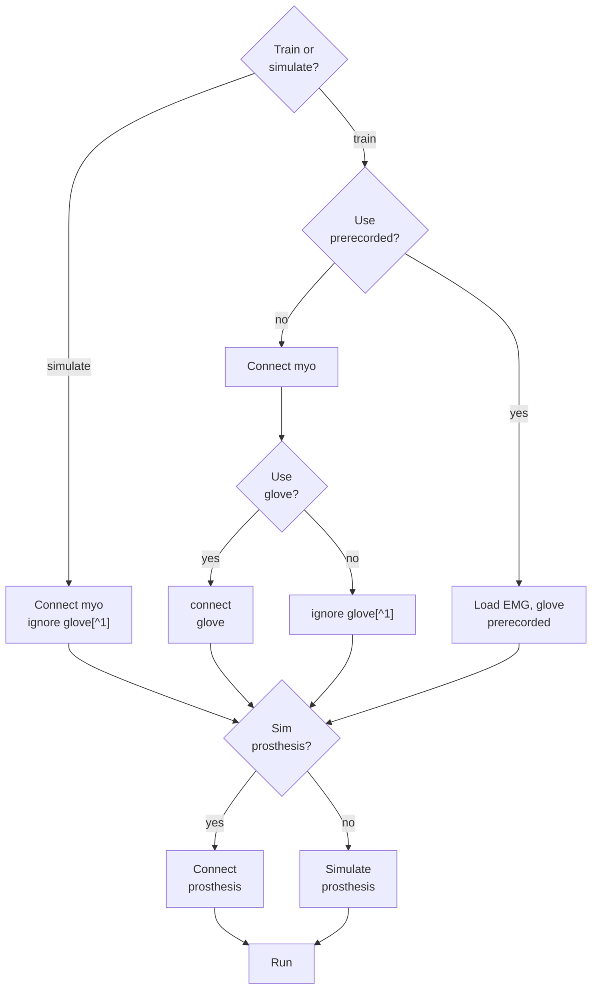

# Prosthesis EPN v2
Code to run the TD3 (Twin Delayed Deep Deterministic Policy Gradient) agent that operates the flexible prosthesis EPN v2.
The agent was trained to imitate the movements open and close of the hand using reinforcement learning. 
It uses the Myo Armband and the flexible prosthesis with an Wemos D1 ESPR32.
 

# Execution

## Initial Setup
Before running any scripts, follow these steps:

### 1. Add paths to MATLAB
Navigate to the **matlab_code** folder and add the required paths:

```matlab
addpath(genpath('C:\Users\joseg\Documents\Tesis\Tesis-Jose-Fuertes\matlab_code\src'))
```

### 2. Verify Myo connection
To check if the Myo armband is properly connected, run:

```matlab
m=Myo
```

This will verify the connection and initialize the Myo device.

## Manual operation
Just run the app **manualOperation.mlapp**.

## Execution [Real time recognition]
* Change the COM port of the prosthesis device in 'config\configurables.m'.
* Check that the simulation flag *params.simMotors* is false, in the script **config/configurables.m**, line 55-56.
* Run the script **runProsthesis.m**.

## Half-hardware execution
When simulating the motors, but using the Myo armband or viceversa, the program has included a time delay to simulate the time it takes to move the prosthesis. It is determined automatically when either the flags ``simMotors`` or ``usePrerecorded`` are false.

## Training and Testing with TD3

### Requirements
* **You must be in the matlab_code folder** before executing training or testing commands.
* Verify hardware flags in **config/configurables.m** (Myo connection and glove connection are boolean flags).

### Main command
The main command to execute training and testing is:

```matlab
trainInterface("td3", "", "")
```

### Configuration before training/testing
Before running the above command, ensure the following in **config/configurables.m**:

1. **Training mode**: Set the flag *params.simMotors* (line 55-56)
   - `true`: Simulate motors (training in simulation)
   - `false`: Use real hardware prosthesis

2. **Hardware flags**:
   - *params.useMyo*: Enable/disable Myo armband connection
   - *params.useGlove*: Enable/disable glove connection

3. **Agent path** (if evaluating a trained agent):
   - Locate the agent path configuration section and set the path to the trained agent you want to evaluate

4. **Training flags** (in the `run_training` section):
   - Set flags to determine whether to train or test
   - Review the training options in *params.RLtrainingOptions*

### Simulation visualization
To customize simulation plots:
1. Edit the `plot_episode.m` file in **src/@Env/**
2. Two plot options are available that can be selected
3. Review **config/configurables.m** for additional plotting settings

### New training
* Set the flag ``newTraining`` to true in the script **src/trainInterface.m**.
* Configure the desired parameters in **config/configurables.m**.
* Run the main command:
```matlab
trainInterface("td3", "", "")
```
* The agent trained will be saved in **trainedAgents/**.

### Continue previous training
* Set the flag ``newTraining`` to false in the script **src/trainInterface.m**.
* Set the ``agentFile`` variable and the ``name`` in the script **src/trainInterface.m**, line 42-43 as corresponding to continue training.
* Run the main command:
```matlab
trainInterface("td3", "", "")
```

### Fine tuning
* Set the flag ``newTraining`` to false in the script **src/fineTuning.m**.
* Set the ``agentFile`` variable and the ``name`` in the script **src/fineTuning.m**, line 34-35 as corresponding to continue training.
* Run the script **src/fineTuning.m**.

## Evaluation of the TD3 agent
* Set the number of episodes in ``params.RLtrainingOptions`` in the file **config/configurables.m**.
* The trained TD3 agent can be evaluated by running the script **src/evalTrainedAgent.m**.
* Evaluation generates episode plots comparing prosthesis position vs. glove reference (ground truth).

## Troubleshooting

### Issue: "trainInterface is not found"
**Error message:**
```
trainInterface is not found in the current folder or on the MATLAB path, but exists in:
    C:\Tesis Denis\EMG_Prosthesis_DQN\matlab_code\src
    C:\Users\joseg\MATLAB\Projects\Tesis\matlab_code\src
```

**Solution:**
* Ensure you are in the **matlab_code** folder
* Make sure you have added the paths correctly:
```matlab
addpath(genpath('C:\Users\joseg\Documents\Tesis\Tesis-Jose-Fuertes\matlab_code\src'))
```

### Issue: "numEmgFeatures is not found"
**Error message:** Variable `numEmgFeatures` is not defined during training.

**Solution:**
1. First, debug the configurables with:
```matlab
configurables
```
2. If the issue persists, clear the configurables variable:
```matlab
clear configurables
```
3. Re-run the training command:
```matlab
trainInterface("td3", "", "")
```

### Issue: "Array indices must be positive integers or logical values" during training
**Error message:**
```
Error using rl.train.SeriesTrainer/run
Array indices must be positive integers or logical values.

Error in rl.train.TrainingManager/train (line 516)
    run(trainer);

Error in rl.train.TrainingManager/run (line 253)
    train(this);

Error in rl.agent.AbstractAgent/train (line 187)
    trainingResult = run(trainMgr,checkpoint);

Error in trainInterface (line 136)
    trainingInfo = train(agent, env, opts);
```

**Solution:**
1. Restart MATLAB completely
2. Add the paths again:
```matlab
addpath(genpath('C:\Users\joseg\Documents\Tesis\Tesis-Jose-Fuertes\matlab_code\src'))
```
3. Run the training command again:
```matlab
trainInterface("td3", "", "")
```

### Issue: Hardware connection problems
If you experience issues with Myo or glove connections:

1. Verify the hardware flags in **config/configurables.m**:
   - Check `params.useMyo` (boolean)
   - Check `params.useGlove` (boolean)

2. Test Myo connection independently:
```matlab
m=Myo
```

3. If using prerecorded data, set `params.usePrerecorded = true` in configurables.m

# Project structure description
* Parameters and configs can be changed in *./config/*.
* The TD3 agent is defined in *./agents/agentTd3.m*.
* Trained TD3 agents are saved in *./trainedAgents/*.
* Main scripts are in the folder *./src/*.
* Temporal files, datasets and backup are saved in *./data/*.
* In every folder is a readme with a general description.


# Dependencies
* Signal Processing Toolbox
* Reinforcement Learning Toolbox
* Deep Learning Toolbox
* mingw compiler
*  Curve Fitting Toolbox [pending]

* **Myo mex**

# Hardware logic

[^1]: ignoring glove uses a mock. 
# Important notes
## Myomex install
This repository comes with the mex function for Windows 10, intel 64bits. In case you need to compile it again, follow the steps described in Myo mex.

## Matlab version changes
* Code developed in Matlab 2021b. 

* For some strange reason in Matlab 2022b code had to be changed.

To handle this issue the following version checking code was added in file 'src/@Env/step/' line 19-22.

```MATLAB
if ~isequal(matlabRelease.Release, "R2021b")
    %adjusting changes in toolbox apart from R2021b
    action = action{1};
end
```

This change fixes problems for **runProsthesis.m**.

Training might need to implement a similar change.


