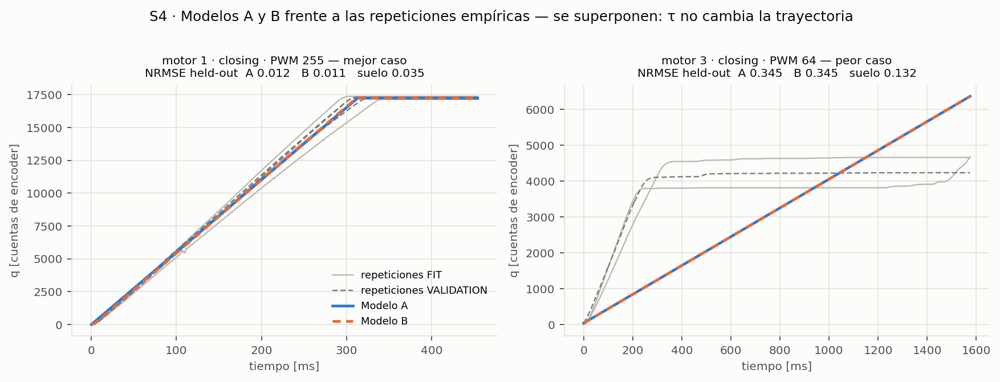
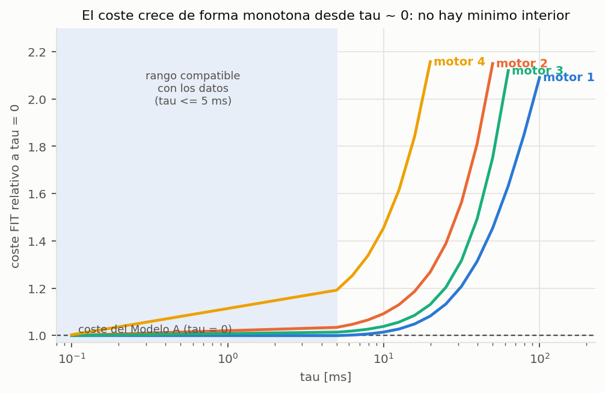
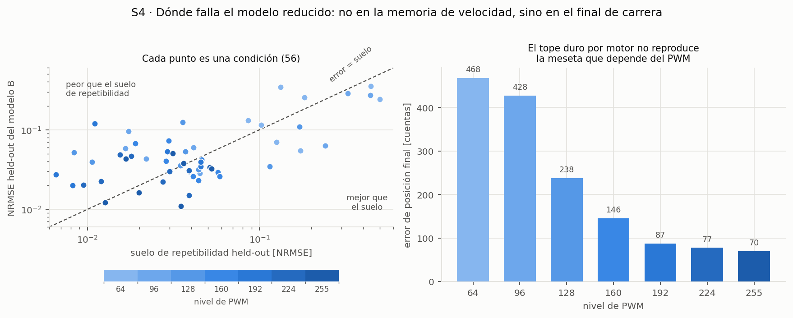

# S4 — Identificación de planta dinámica reducida · RESULTADOS

> **`S4_RESULT = DYNAMIC_MEMORY_NOT_JUSTIFIED`.** Añadir memoria de velocidad no mejora
> nada: el `tau` identificado es ≤ 2.7 ms, la mejora relativa mediana en validación
> held-out es **−0.016 %**, y el Modelo B es *peor* que el Modelo A en 32 de 56
> condiciones. Ninguna condición mejora por encima del suelo de repetibilidad. No se crea
> `DynamicPlantAdapter`. S5 y S6 quedan bloqueadas por este veredicto.
>
> El hallazgo útil no es el rechazo en sí: es **dónde** está el error. El modelo reducido
> falla en el final de carrera, no en el arranque. Ver §8.

Contra el gate de `PREREGISTRO_S4_DYNAMIC_IDENTIFICATION.md` §7, sin mover ningún umbral.

| Criterio | Umbral | Medido | Resultado |
|---|---|---|---|
| **C1** mejora relativa mediana | ≥ 0.20 | **−0.00016** | **FAIL** |
| **C2** B no peor que A | ≥ 42/56 | **24/56** | **FAIL** |
| **C3** mejora por encima del suelo | ≥ 28/56 | **0/56** | **FAIL** |
| **C4** violaciones de dirección / límite | 0 y 0 | **0 y 0** | PASS |
| **C5** convergencia numérica | ≤ 0.5 cuentas | **3.2e-08** | PASS |

C1, C2 y C3 fallan ⇒ `DYNAMIC_MEMORY_NOT_JUSTIFIED` y parada, según el §7 del preregistro.

---

## 1. Repeatability floor encontrado

Calculado **antes** del ajuste, sólo con repeticiones FIT: desviación típica entre
repeticiones, RMS sobre el tiempo, por condición.

| Estadístico | `floor_sd` [cuentas] | `floor_nrmse` [fracción de carrera] |
|---|---:|---:|
| mínimo | 30.4 | 0.0047 |
| **mediana** | **279.9** | **0.0320** |
| media | 451.5 | 0.0639 |
| máximo | 1934.3 | 0.4089 |

Mediana del suelo held-out esperado (el error que tendría un predictor **perfecto** sobre
una repetición no vista): **0.0380** en NRMSE.

Por PWM: 64 → **0.1244**, 96 → 0.0352, 128 → 0.0315, 160 → 0.0370, 192 → 0.0164,
224 → 0.0196, 255 → 0.0286. Por motor: m1 0.0320, m2 0.0356, m3 0.0409, m4 0.0150.

**Lectura.** A PWM bajo las repeticiones no se parecen entre sí: hasta el 41 % de la
carrera en m2 apertura a 64. Buena parte de esa dispersión es probablemente variabilidad
de **fase temporal** entre ensayos —las curvas se comparan índice a índice y un desfase
pequeño produce una diferencia enorme donde la curva es empinada—, pero eso es una
**hipótesis explicativa, no un hecho medido**: separarla exigiría alinear temporalmente las
repeticiones, y alinear cambia la pregunta.

Consecuencia práctica: por debajo de ~3 % de NRMSE **no hay nada que discriminar**, y a
PWM 64 no hay nada que discriminar por debajo de ~15 %.

## 2. Split de repeticiones

Congelado antes de ajustar, determinista y sin semilla: **FIT = repeticiones impares,
VALIDATION = repeticiones pares**. Alternar protege frente a deriva entre ensayos mejor que
"primera mitad / segunda mitad".

| Repeticiones disponibles | Condiciones | FIT | VALIDATION |
|---:|---:|---:|---:|
| 6 | 24 | 3 | 3 |
| 5 | 8 | 3 | 2 |
| 4 | 12 | 2 | 2 |
| 3 | 12 | 2 | 1 |

Total: **144 repeticiones FIT** y **124 VALIDATION**, disjuntas por construcción, sobre
160 848 muestras. Archivo versionado: `s4_repetition_split.csv`. Se verificó que `avg` es
exactamente la media de `data`, de modo que **no se ajustó contra `avg`** en ningún momento.

Aislamiento comprobado por test, no por confianza: `testFitIgnoresValidationRepetitions`
corrompe las repeticiones VALIDATION en memoria (`val*3 + 1234`) y exige que los parámetros
ajustados no cambien.

## 3. Modelo A — baseline cinemático

`dq/dt = v_inf(motor, dirección, PWM)`, con límite empírico duro. 56 parámetros.

Validación held-out: **NRMSE mediana 0.0423**, media 0.0742, máximo 0.3533.
RMSE mediana 355.5 cuentas. Cero violaciones de dirección y de límite.

`v_inf` identificado [cuentas/s]:

| motor | dir | 64 | 96 | 128 | 160 | 192 | 224 | 255 |
|---|---|---:|---:|---:|---:|---:|---:|---:|
| 1 | cierre | 10 662 | 28 037 | 40 852 | 44 859 | 47 927 | 51 284 | 55 111 |
| 1 | apertura | −23 022 | −36 617 | −44 073 | −49 297 | −53 811 | −57 076 | −61 073 |
| 2 | cierre | 2 455 | 6 854 | 28 649 | 34 454 | 31 607 | 43 188 | 44 324 |
| 2 | apertura | −10 356 | −24 198 | −32 207 | −37 972 | −43 675 | −46 055 | −50 544 |
| 3 | cierre | 4 018 | 6 365 | 33 928 | 38 639 | 37 398 | 43 065 | 48 013 |
| 3 | apertura | −19 293 | −29 006 | −37 557 | −43 387 | −46 573 | −49 960 | −53 217 |
| 4 | cierre | 10 402 | 17 421 | 31 141 | 32 746 | 30 184 | 41 290 | 41 753 |
| 4 | apertura | −14 838 | −25 023 | −35 874 | −42 495 | −42 610 | −44 690 | −48 726 |

Dos regularidades que el ajuste **no** impuso y que aparecen solas:

1. `v_inf` crece de forma casi monótona con el PWM y **satura**: de 64 a 128 gana mucho, de
   192 a 255 poco. Coherente con el diagnóstico E0P de pérdida de gradación a PWM alto.
2. **Abrir es sistemáticamente más rápido que cerrar** al mismo PWM, en los 4 motores y en
   los 7 niveles (m1 a 64: −23 022 frente a +10 662). Mecánicamente razonable —cerrar
   trabaja contra el tendón, abrir está asistido— pero aquí es una **observación del
   ajuste**, no una medida de fuerza.

**Caveat de honestidad:** en **17 de 56** condiciones `v_inf` queda pegado al bound superior
del preregistro (`3 · carrera / duración`). En esas condiciones el valor de la tabla **no es
un óptimo libre**, sino el bound. Se conserva porque el bound estaba preregistrado y porque
afecta a A y a B por igual; se marca en `s4_identified_parameters.csv` (`at_bound`).

## 4. Modelo B — candidato principal

`dq/dt = v`, `dv/dt = (v_inf − v)/tau(motor)`, `v(0) = 0`. 60 parámetros (56 `v_inf` + 4 `tau`).

Validación held-out: **NRMSE mediana 0.0426**, media 0.0741, máximo 0.3533. Cero
violaciones. Es decir: **indistinguible de A**, y en la mediana marginalmente peor.

| Comparación | Valor |
|---|---:|
| B mejor que A | 24/56 |
| B peor que A | 32/56 |
| Mejora relativa mediana | **−0.016 %** |
| Mejora relativa máxima (una condición) | 16.1 % |
| Mejora **absoluta** máxima | **42.0 cuentas** |
| Condiciones con mejora > suelo de repetibilidad | **0/56** |

La mejor mejora absoluta de todo el experimento, 42 cuentas, es **6.7 veces menor** que la
mediana del suelo de repetibilidad (280 cuentas). No hay señal.



*Izquierda, mejor caso: el modelo cae dentro de la dispersión entre repeticiones. Derecha,
peor caso: las curvas reales suben en 250 ms y se aplanan en ~4 200–4 700 cuentas mientras
el modelo rampa durante 1 576 ms, porque su tope duro está en 7 672. Las líneas de A y B se
superponen: `tau` no cambia la trayectoria.*

Análisis secundario **descriptivo** (declarado en el preregistro, no puede cambiar el
veredicto): excluyendo las 3 condiciones con suelo > 0.15, quedan 48 condiciones y la
mejora relativa mediana es **−0.001 %**, con B no peor en 24/48. La conclusión no depende de
las condiciones ruidosas.

## 5. Parámetros identificados

**`tau` por motor**: m1 **2.66 ms**, m2 **0.10 ms**, m3 **0.10 ms**, m4 **0.10 ms**.

Tres de los cuatro caen **en el bound inferior** del preregistro (`1e-4 s`): el optimizador
quiere `tau = 0`, es decir, quiere el Modelo A. El perfil de coste FIT frente a `tau` crece
de forma **monótona** desde `tau ≈ 0` en los cuatro motores: no hay mínimo interior.

`v_inf`: la tabla del §3 (los valores de B difieren de los de A en la cuarta cifra
significativa, como corresponde a `tau ≈ 0`).

**Los parámetros son fenomenológicos y punto.** No son `J`, `B` ni `Kt`, y con estos datos
no pueden serlo: cualquier trío con `Kt/B = v_inf/u` y `J/B = tau` produce exactamente la
misma trayectoria. La no identificabilidad es un **resultado**, no un defecto del método.

## 6. ¿Aporta `tau` información real? No, y con un límite cuantitativo

Tres comprobaciones independientes, todas negativas:

1. **Perfil de coste** (figura 3): monótono creciente desde `tau ≈ 0` en los 4 motores. A
   `tau = 20 ms` el coste FIT ya es 1.06–2.16 veces el de `tau = 0`.
2. **Validación held-out**: mejora mediana −0.016 %, 0/56 condiciones por encima del suelo.
3. **Prueba de equidad** — la más importante. Se podría objetar que la meseta domina el
   error y esconde un transitorio real. Se reajustó **sólo sobre el tramo de subida** de
   cada curva (excluyendo la meseta) y con un bound de `v_inf` el doble de ancho (6×):

   | motor | mejor `tau` | mejora en RMSE de subida | `tau` = 20 ms |
   |---|---:|---:|---:|
   | 1 | 5 ms | 0.4 % | +6.0 % peor |
   | 2 | 0 ms | 0.0 % | +4.0 % peor |
   | 3 | 0 ms | 0.0 % | +3.1 % peor |
   | 4 | 5 ms | 1.9 % | +6.3 % peor |



**Conclusión cuantitativa:** los datos son compatibles con `tau ≤ ~5 ms` y **rechazan**
`tau ≥ 20 ms`. Con `Ts = 0.2 s`, un `tau` de 5 ms ocupa el **2.5 %** de un paso de control.
La memoria de velocidad es irrelevante a la escala temporal a la que opera el controlador.

Esto **no** dice que la prótesis física carezca de inercia. Dice que, con la resolución y la
repetibilidad de `pattern_curve.mat`, un modelo de primer orden en velocidad no captura nada
que el modelo instantáneo no capture ya.

## 7. Errores por motor, dirección y PWM

Mediana de NRMSE held-out, con el suelo de repetibilidad al lado y su cociente:

| Corte | NRMSE A | NRMSE B | suelo | **B / suelo** | endpoint [cuentas] |
|---|---:|---:|---:|---:|---:|
| motor 1 | 0.0298 | 0.0292 | 0.0380 | **0.77** | 160 |
| motor 2 | 0.0527 | 0.0527 | 0.0411 | 1.28 | 176 |
| motor 3 | 0.0348 | 0.0349 | 0.0486 | **0.72** | 207 |
| motor 4 | 0.0524 | 0.0525 | 0.0176 | **2.98** | 143 |
| cierre | 0.0517 | 0.0521 | 0.0359 | 1.45 | 158 |
| apertura | 0.0351 | 0.0350 | 0.0412 | 0.85 | 178 |
| PWM 64 | 0.1868 | 0.1869 | 0.1524 | 1.23 | 468 |
| PWM 96 | 0.0614 | 0.0615 | 0.0431 | 1.43 | 428 |
| PWM 128 | 0.0456 | 0.0457 | 0.0364 | 1.26 | 238 |
| PWM 160 | 0.0348 | 0.0349 | 0.0427 | **0.82** | 146 |
| PWM 192 | 0.0368 | 0.0368 | 0.0201 | 1.83 | 87 |
| PWM 224 | 0.0262 | 0.0263 | 0.0227 | 1.16 | 77 |
| PWM 255 | 0.0330 | 0.0329 | 0.0330 | **1.00** | 70 |

**En 28 de las 56 condiciones el modelo cinemático simple ya está en el suelo de
repetibilidad o por debajo.** Donde no lo está, el patrón es claro:

- **Motor 4** es el peor caso relativo: casi 3 veces su suelo. Su repetibilidad es la mejor
  de los cuatro (0.0176) y aun así el modelo no la alcanza: ahí sí hay estructura sin
  modelar.
- **PWM bajo** (64, 96) concentra el error absoluto: NRMSE 0.19 y 0.06, con errores de
  posición final de 468 y 428 cuentas.
- **Cierre** es peor que **apertura** (1.45 frente a 0.85 veces el suelo).

## 8. Límites del modelo — dónde falla de verdad



El error dominante **no** está en el arranque. Está en el **final de carrera**:

1. **La meseta empírica depende del PWM y el modelo no puede reproducirlo.** El motor 1
   cierra hasta 14 316 cuentas a PWM 64 y hasta 17 246 a PWM 255. El límite duro del
   preregistro es **por motor**, así que a PWM bajo el modelo no tiene con qué detenerse:
   rampa linealmente durante todo el registro mientras la curva real sube rápido y se
   aplana. El error de posición final cae monótonamente de **468 cuentas a PWM 64 a 70 a
   PWM 255** — la firma exacta de ese fallo.
2. **La causa mecánica plausible es el equilibrio de fuerzas contra el tendón elástico**: a
   más PWM, más fuerza y más recorrido antes de detenerse. Representarlo exige el **tope
   elástico** (`k_limit`, `c_limit`) que el preregistro dejó fuera por no estar
   identificado. Sigue en BACKLOG y sigue sin estar identificado.
3. **La forma real es sigmoide, no rampa.** En el mejor caso medido (m1 cierre PWM 255) la
   velocidad sube desde 0, alcanza su máximo (≈128 000 cuentas/s) a los **110 ms** y después
   decae hacia la meseta. Ni A ni B pueden decelerar: sólo saturan de golpe contra el tope.
   Ese "no puede decelerar" es una limitación estructural mucho mayor que "no tiene memoria
   de velocidad".
4. **38 de las 56 curvas promedio no son monótonas.** Ninguna EDO estable de este orden
   reproducirá esas ondulaciones. Tampoco se llaman "ruido" aquí: no hay evidencia para
   decidirlo, y la dispersión entre repeticiones sugiere que parte es fase, no ruido blanco.
5. **17 de 56 `v_inf` en el bound**: en esas condiciones el ajuste está limitado por el
   preregistro, no por los datos.
6. **Todo esto es simulación contra caracterización.** No hay validación contra hardware.
   Nada de esta etapa es "sim-to-real".

## 9. Decisión S4

`S4_RESULT = DYNAMIC_MEMORY_NOT_JUSTIFIED`. **No se crea `DynamicPlantAdapter`.** S5
(same-action replay) y S6 (closed-loop replay) quedan **bloqueadas**: sin una segunda planta
válida no hay nada que comparar, y comparar la planta canónica contra un modelo rechazado
sería fabricar un resultado.

**Qué hipótesis señalan los datos para una eventual S4b** —requiere su propio preregistro y
autorización explícita, no se abre aquí:

> La estructura dominante de estas curvas es una **velocidad que depende de la posición**,
> `dq/dt = f(q, u)`, no una velocidad con memoria. Es exactamente lo que la planta canónica
> ya es: un seguidor de curva indexado por posición. La pregunta útil no es "¿le añadimos
> inercia?" sino "¿puede una `f(q, u)` paramétrica con pocos parámetros reproducir
> `pattern_curve` dentro del suelo de repetibilidad?". Si la respuesta fuera que sí, se
> tendría una planta reducida real; si fuera que no, se tendría evidencia de que la
> representación empírica **no conviene reemplazarla** — que era uno de los desenlaces
> útiles previstos en `SANDBOX_PLAN.md` §7.

Y un resultado colateral que sí es directamente aprovechable: **en la mitad de las
condiciones —y en particular a PWM ≥ 160, donde la política opera el 76 % del tiempo según
E2A— un modelo de velocidad constante con tope ya reproduce los datos dentro de la
repetibilidad de la caracterización.**

---

## Reproducción

```matlab
% MATLAB nuevo, en EMG_Prosthesis_TD3/matlab_code
addpath(genpath('src')); addpath('config'); addpath(genpath('lib'));
addpath(genpath('sandbox_physics'));
summary = runSandboxS4Identification();
runtests(fullfile('sandbox_physics','tests','testSandboxS4Identification.m'))
```

Artefactos en `identification/` (versionables) y `results/s4_identification/` (salidas):
`s4_repetition_split.csv`, `s4_condition_floor.csv`, `s4_identified_parameters.csv`,
`s4_validation_heldout.csv`, `s4_summary.json`, y las tres figuras `s4_fig*.png`.

**Los números de este documento se calcularon fuera de MATLAB**, con una reimplementación
de la planta canónica que reproduce los 190 pasos sin guante de E2A con error máximo
3.46e-11 cuentas. El código MATLAB entregado ejecuta el mismo procedimiento y es el que
certifica el resultado: hasta ejecutarlo, este informe es **una predicción reproducible, no
una medida en MATLAB**.
